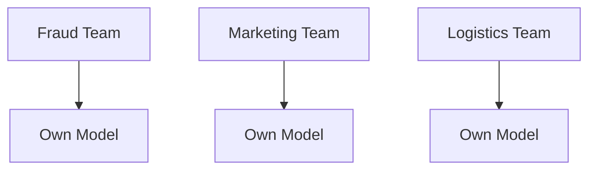
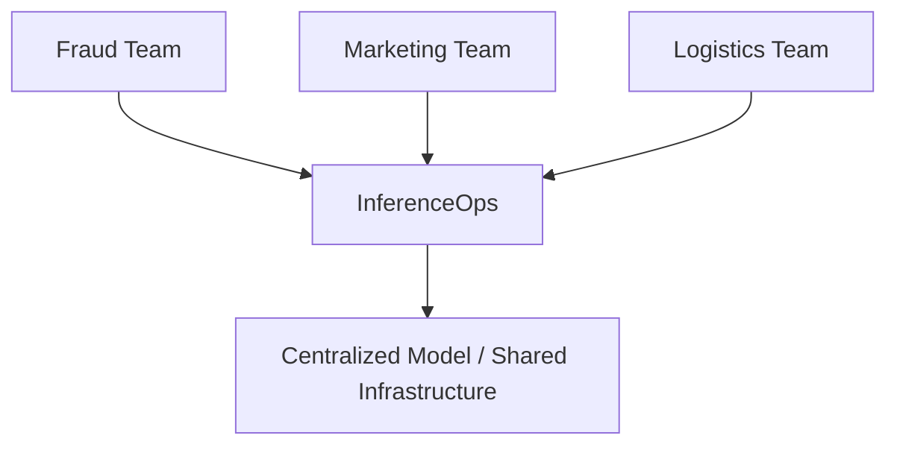
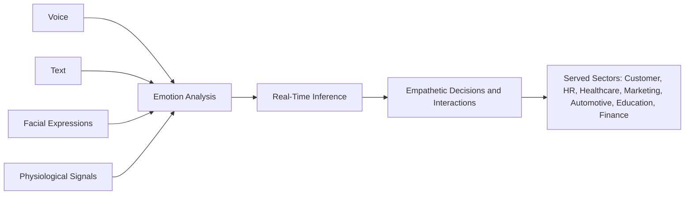
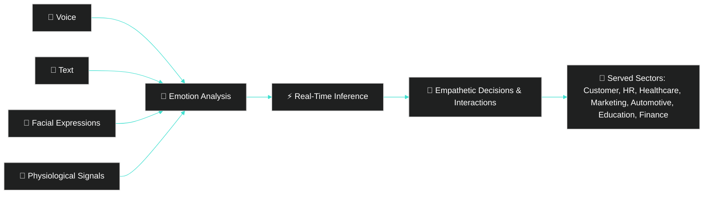
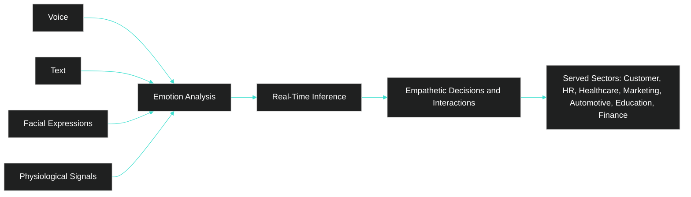

## 4. [Direct Comparison Between Models -  Diagrams]()

 

### 
 [Before]() (Traditional ML)

  

 

#

 

### 
  [After]() (InferenceOps)

  

 

#

 

### 
 [Multimodal]() Data Flow

  

### 
 InferenceOps – Centralization and Governance

%%{init: {'theme': 'dark', 'themeVariables': { 'primaryColor': '#1E1E1E', 'primaryBorderColor': '#40E0D0', 'lineColor': '#40E0D0', 'textColor': '#FFFFFF'}}}%%
graph TD
    A[⚙️ InferenceOps] --> B[📊 Centralizes Emotional Models]
    A --> C[🚀 Operationalizes Inference]
    A --> D[👥 Multi-Team Scalability]
    A --> E[🔍 Auditable Governance]
    A --> F[💰 Cost Reduction]
    A --> G[📡 Real-Time Monitoring]
    A --> H[📜 Regulatory Compliance]
