```mermaid
flowchart TD
    A[Equipe de Fraude] --> Z[InferenceOps]
    C[Equipe de Marketing] --> Z
    E[Equipe de Logística] --> Z
    Z --> M[Modelo Centralizado / Infraestrutura Compartilhada]
```

```mermaid
%%{init: {'theme': 'dark', 'themeVariables': { 'primaryColor': '#1E1E1E', 'primaryBorderColor': '#40E0D0', 'lineColor': '#40E0D0', 'textColor': '#FFFFFF'}}}%%
flowchart LR
    A[🎤 Voz] --> B[🧠 Análise de Emoções]
    C[💬 Texto] --> B
    D[🙂 Expressões Faciais] --> B
    E[💓 Sinais Fisiológicos] --> B
    B --> F[⚡ Inferência em Tempo Real]
    F --> G[🤝 Decisões & Interações Empáticas]
    G --> H[🏢 Setores Atendidos: Clientes, RH, Saúde, Marketing, Automotivo, Educação, Finanças]
```

```mermaid
%%{init: {'theme': 'dark', 'themeVariables': { 'primaryColor': '#1E1E1E', 'primaryBorderColor': '#40E0D0', 'lineColor': '#40E0D0', 'textColor': '#FFFFFF'}}}%%
graph TD
    A[⚙️ InferenceOps] --> B[📊 Centraliza Modelos Emocionais]
    A --> C[🚀 Operacionaliza Inferência]
    A --> D[👥 Escalabilidade Multi-equipes]
    A --> E[🔍 Governança Auditável]
    A --> F[💰 Redução de Custos]
    A --> G[📡 Monitoramento em Tempo Real]
    A --> H[📜 Conformidade Regulatória]
```

## 4. [Direct Comparison Between Models -  Diagrams]()

 

### 
 [Before]() (Traditional ML)

  

 

#

 

### 
  [After]() (InferenceOps)

  

 

#

 

### 
 [Multimodal]() Data Flow

  

### 
 InferenceOps – Centralization and Governance

```mermaid
%%{init: {'theme': 'dark', 'themeVariables': { 'primaryColor': '#1E1E1E', 'primaryBorderColor': '#40E0D0', 'lineColor': '#40E0D0', 'textColor': '#FFFFFF'}}}%%
flowchart LR
    A[🎤 Voice] --> B[🧠 Emotion Analysis]
    C[💬 Text] --> B
    D[🙂 Facial Expressions] --> B
    E[💓 Physiological Signals] --> B
    B --> F[⚡ Real-Time Inference]
    F --> G[🤝 Empathetic Decisions & Interactions]
    G --> H[🏢 Served Sectors: Customer, HR, Healthcare, Marketing, Automotive, Education, Finance]
```

%%{init: {'theme': 'dark', 'themeVariables': { 'primaryColor': '#1E1E1E', 'primaryBorderColor': '#40E0D0', 'lineColor': '#40E0D0', 'textColor': '#FFFFFF'}}}%%
graph TD
    A[⚙️ InferenceOps] --> B[📊 Centralizes Emotional Models]
    A --> C[🚀 Operationalizes Inference]
    A --> D[👥 Multi-Team Scalability]
    A --> E[🔍 Auditable Governance]
    A --> F[💰 Cost Reduction]
    A --> G[📡 Real-Time Monitoring]
    A --> H[📜 Regulatory Compliance]

  
  

  ## ================================ Portugues =====================

  
  

## 4. [Comparação Direta Entre Modelos - Diagramas]()

 

### 
 [Antes]() - ML Tradicional

  

 

#

 

### 
 Depois - InferenceOps

  

 

#

 

### 
 [Multimodal]() - Fluxo de Dados

  

 

#

 

### 
 InferenceOps – Centralização e Governança

  

