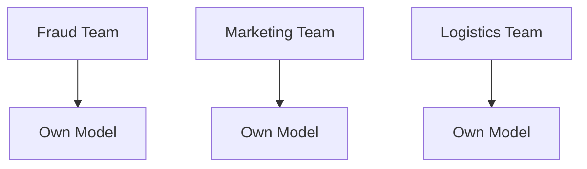
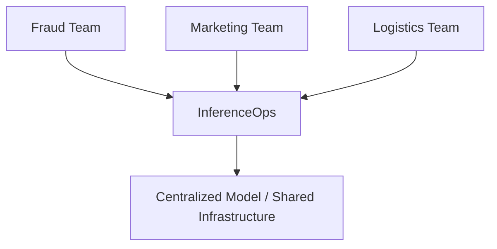
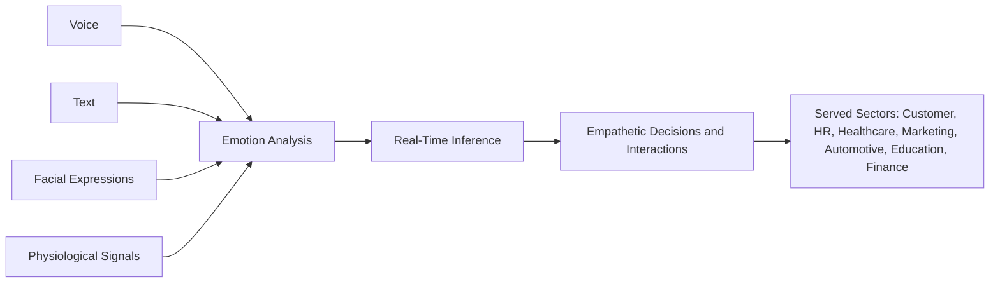
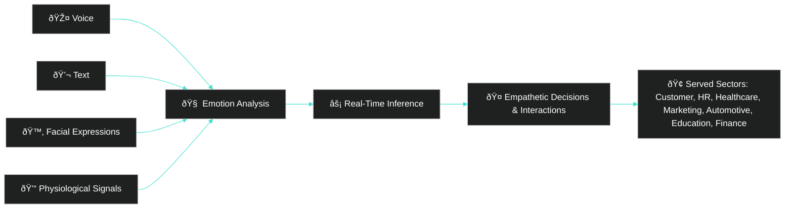
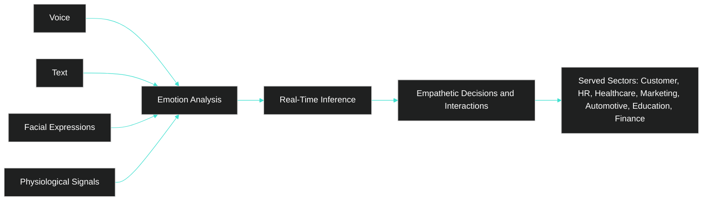

## 4. [Direct Comparison Between Models -  Diagrams]()

 

### 
 [Before]() (Traditional ML)

  

```mermaid
flowchart TD
    A[Fraud Team] --> B[Own Model]
    C[Marketing Team] --> D[Own Model]
    E[Logistics Team] --> F[Own Model]
```

 

#

 

### 
  [After]() (InferenceOps)

  

```mermaid
flowchart TD
    A[Fraud Team] --> Z[InferenceOps]
    C[Marketing Team] --> Z
    E[Logistics Team] --> Z
    Z --> M[Centralized Model / Shared Infrastructure]
```

 

#

 

### 
 [Multimodal]() Data Flow

  

```mermaid
flowchart LR
    A[Voice] --> B[Emotion Analysis]
    C[Text] --> B
    D[Facial Expressions] --> B
    E[Physiological Signals] --> B
    B --> F[Real-Time Inference]
    F --> G[Empathetic Decisions and Interactions]
    G --> H[Served Sectors: Customer, HR, Healthcare, Marketing, Automotive, Education, Finance]
```

```mermaid
%%{init: {'theme': 'dark', 'themeVariables': { 'primaryColor': '#1E1E1E', 'primaryBorderColor': '#40E0D0', 'lineColor': '#40E0D0', 'textColor': '#FFFFFF'}}}%%
flowchart LR
    A[🎤 Voice] --> B[🧠 Emotion Analysis]
    C[💬 Text] --> B
    D[🙂 Facial Expressions] --> B
    E[💓 Physiological Signals] --> B
    B --> F[âš¡ Real-Time Inference]
    F --> G[🤠Empathetic Decisions & Interactions]
    G --> H[🢠Served Sectors: Customer, HR, Healthcare, Marketing, Automotive, Education, Finance]
```

```mermaid
%%{init: {'theme': 'dark', 'themeVariables': { 'primaryColor': '#1E1E1E', 'primaryBorderColor': '#40E0D0', 'lineColor': '#40E0D0', 'textColor': '#FFFFFF'}}}%%
flowchart LR
    A[Voice] --> B[Emotion Analysis]
    C[Text] --> B
    D[Facial Expressions] --> B
    E[Physiological Signals] --> B
    B --> F[Real-Time Inference]
    F --> G[Empathetic Decisions and Interactions]
    G --> H[Served Sectors: Customer, HR, Healthcare, Marketing, Automotive, Education, Finance]
```

