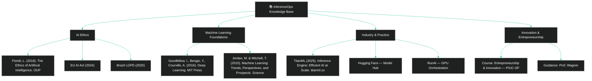

  
 
 \[[🇧🇷 Português](README.pt_BR.md)\] \[**[🇺🇸 English](README.md)**\]

    

 
 #  
  [InferenceOps](): Scalable, Governed, and Ethical AI

  

#### 
 

  

https://github.com/user-attachments/assets/e2771de0-ca57-4750-b708-74f0dceaade3

###### 🎶  ***[Vivaldi - The Four Seasons 'Winter']()  ⚡️ Art by Fabi***  

<!--Confidentiality Statement-->

  

##  Table of Contents

 

> [!TIP]
>   1. [Introduction](#1-introduction)  
>   2. [The Problem: Traditional ML vs Modern AI](#2-the-problem-traditional-ml-vs-modern-ai)  
>   3. [The Solution — InferenceOps](#3-the-solution--inferenceops)
>   4. [Explanatory Diagrams](#4-explanatory-diagrams) 
>   5. [Direct Comparison](#5-direct-comparison)   
>   6. [Ethical Dimension](#6-ethical-dimension)    
>   7. [Real Market Use Cases](#7-real-market-use-cases) 
>   8. [Practical Case — Fraud Detection](#8-practical-case--fraud-detection)
>   9. [Implementation Best Practices](#9-implementation-best-practices)  
>   10. [Social Impact](#10-social-impact) 
>   11. [KPIs and Success Metrics](#11-kpis-and-success-metrics)  
>   12. [Business Plan and Profitability](#12-business-plan-and-profitability)  
>   13. [Implementation Roadmap](#13-implementation-roadmap)  
>   14. [FAQ (Frequently Asked Questions)](#14-faq-frequently-asked-questions) 
>   15. [Repository Structure](#15-repository-structure) 
>   16. [📊 Financial Plan (InferenceOps-Innovation)](#16-financial-plan-inferenceops-innovation)  
>   17. [Revenue vs Costs - Code]()
>   18. [Additional Code Examples]()
>    - [Financial Analysis Code]() 
>    - [Fraud Detection Simulation]()
>   19. 🧑🏼‍🚀 [Team Members]():
>  20. [Bibliography]()
>
> 

    
     
  

## 1. [Introduction]()

This project was developed for the course **Entrepreneurship and Innovation** as part of the [**Humanistic AI and Data Science undergraduate program at PIUC - São Paulo**](), under the guidance of [**Professor Wagner  Tufano**]().

The objective of this work is to demonstrate how organizations can move [**beyond traditional MLOps practices**]() and adopt [**InferenceOps**]() as a new operational paradigm for Artificial Intelligence.  

While MLOps was designed to manage Machine Learning pipelines and model lifecycles, [**InferenceOps**]() addresses the unique challenges of deploying and scaling AI systems that go beyond statistical models — systems capable of reasoning, adapting, and interacting in real time.  

InferenceOps is not just a technical shift; it represents an [**innovative, ethical, and financially viable approach**]() to AI adoption, ensuring scalability, governance, and trust.  

This repository combines [**technical foundations**](), [**real-world applications**](), and a [**financial plan**]() to illustrate how InferenceOps can be implemented sustainably and profitably.

  

## 2. [The Problem: Traditional ML vs Modern AI]()

 

### [Traditional ML (past)]()

- Each team had its own model (fraud, marketing, logistics).
- It worked because models were simple and isolated.

 
 
  
[Examples]():
  
  - A bank with a basic fraud model only for credit cards.
  - An e-commerce with a simple product recommendation model.

 

#

 

### [Modern AI (present)]()

 

- Models are **complex, heavy, multimodal** (text, image, audio).
- They require GPUs, clusters, and continuous monitoring.

[If each team runs its own model]():
  
  - Costs skyrocket.
  - Results are inconsistent.
  - Auditing becomes impossible.

  

  
  
  
  
  
  

## 19. 🧑🏼‍🚀 [Team Members]():

| Name                    | Role                                             |
|-------------------------|--------------------------------------------------|
| **Andson Ribeiro**       | [Github](https://github.com/andsonandreribeiro09) - [Contact]() |
| **Fabiana ⚡️ Campanari** | [Github](https://github.com/FabianaCampanari) - [Contact Hub](https://linktr.ee/fabianacampanari)   |
| **Luan Fabiano**         | [Github](https://github.com/LuanFabiano28) -  [Contact]() |
| **Pedro Barrenco**       |   [Github]()  - [Contact]()   |
|  **Pedro Vyctor Almeida** |  [Github](https://github.com/ppvyctor) - [Contact]()    |

  

 ##  20.[References / Bibliography]()
   
      

  

[-]() Jordan, M. & Mitchell, T. (2015). Machine learning: Trends, perspectives, and prospects. Science, 349(6245).

[-]() Floridi, L. (2019). The Ethics of Artificial Intelligence. Oxford University Press.

[-]() Goodfellow, I., Bengio, Y., & Courville, A. (2016). Deep Learning. MIT Press.

[-]() TitanML. (2025). TitanML Inference Engine: Efficient AI at Scale. Retrieved from https://www.titanml.co

[-]() European Union. (2024). EU AI Act — Regulation on Artificial Intelligence.

  

## 💌 [Let the data flow... Ping Us]()

- 👩🏻‍🚀 **Fabiana ⚡️ Campanari** - [Shoot me an email](mailto:fabicampanari@proton.me)
  
- 🧑🏼‍🚀 **PedroVyctor** - [Hit me up by email](mailto:pedro.vyctor00@gmail.com)

- 👨🏽‍🚀 **Andson Ribeiro** - [Slide into my inbox]()

  

#### 
  🛸๋ My Contacts [Hub](https://linktr.ee/fabianacampanari)

 

### 
 

  

  ────────────── ⊹🔭๋ ──────────────

<!--

  ────────────── 🛸๋*ੈ✩* 🔭*ੈ₊ ──────────────
-->

 

 ➣➢➤ <a href="#top">Back to Top </a>
  

#

##### 
 Copyright 2025 Mindful-AI-Assistants. Code released under the  [MIT license.](https://github.com/Mindful-AI-Assistants/planet-smart-city-laguna-iot-pucsp/blob/7ac78ed36a9256cbdc0941dbd44fd13b545bc2dd/LICENSE)

