```mermaid
%%{init: {'theme': 'dark', 'themeVariables': { 'primaryColor': '\#1E1E1E', 'primaryBorderColor': '\#40E0D0', 'lineColor': '\#40E0D0', 'textColor': '\#FFFFFF'}}}%%
graph TD
A[⚙️ InferenceOps] --> B[📊 Centralizes Emotional Models]
A --> C[🚀 Operationalizes Inference]
A --> D[👥 Multi-Team Scalability]
A --> E[🔍 Auditable Governance]
A --> F[💰 Cost Reduction]
A --> G[📡 Real-Time Monitoring]
A --> H[📜 Regulatory Compliance]
```
 

 \[[🇧🇷 Português](README.pt_BR.md)\] \[**[🇺🇸 English](README.md)**\]
 

⠀⠀⠀.　　　　　　　　　　　　　.　　　ﾟ .　　　　　　　　　　　　　. 　　　　　　　　　　　　　　　✦ 　　　　　,　　　　　　　.
⠀⠀⠀⠀⠀⠀⠀⠀⠀⠀⠀⠀⠀⠀⠀⠀⠀
　　　　　　*　　　　　　　　　　　.　✦
　　　　　　*　　　　　　　　. 　　
.　　　　　　　　　　　　　. 　　✦⠀　   　　　,　　　　　　　　　*
　　　　　⠀　　　　⠀　　,
⠀⠀⠀⠀⠀⠀⠀⠀⠀⠀⠀⠀.　　　　　 　　⠀　　　⠀.　
 　　˚　　　⠀　⠀  　　,　  
  [𝛹](https://github.com/user-attachments/assets/4d29c964-8c36-456e-8a04-68fab9ac710c)  𝑬𝒗𝒆𝒓𝒚 𝒐𝒏𝒆 𝒊𝒔 𝒖𝒏𝒊𝒒𝒖𝒆 𝒊𝒏 𝒕𝒉𝒆𝒊𝒓 𝒐𝒘𝒏 𝒘𝒂𝒚   .⭒⋅⊹｡
　　　　　　　　　　　　　.
　　　　　　*⠀　　⠀  　　　　　　　　　　　　

　　　　.　　　　.　　　⠀
　　　　　　　　　　　.   
　　　　　　　
　　　˚　　　　　　　　　　　　　.     

 .⠀　　⠀‍⠀‍⠀‍⠀‍⠀‍⠀‍⠀‍⠀‍⠀‍⠀‍⠀,    
　　　*　　⠀.
　　　　　.　　　　　　　　　　⠀[𖤐](https://github.com/user-attachments/assets/f239865a-de13-4975-a3fd-54d2bb456e01)
　˚　　　　　　　　　　　　　　
.⠀ 　　　　　　　　　　.　　　　　　　　.
　　　　　✦⠀　   　　　,　　    　　　　　　　　.

  

 ### 
 ✯ **[Project Startup]()** ✯

   

<h1 align="center">  $$\Huge {\textbf{\color{cyan} Mindful Emotional AI} \space \textbf{\color{white}   InferenceOps • Ethical} \space \textbf{\color{cyan} 𝚿}}$$ 

  

<!-- VIDEO -->

https://github.com/user-attachments/assets/0aa46a55-41b6-4c51-92a6-82aba37e3221

<!--VIDEO TORSION COUNSC

https://github.com/user-attachments/assets/9915b330-9845-421d-97ca-6f733d455db0

##### 🎶  ***Creation  by Fabi***  🖤
--->

<!--=== ViDEO  VIVALDI
https://github.com/user-attachments/assets/e2771de0-ca57-4750-b708-74f0dceaade3

###### 🎶  ***[Vivaldi - The Four Seasons 'Winter']()  ⚡️ Art by Fabi***  
-->

  

 ### 
 [***Slides Presentation***](https://www.beautiful.ai/player/-OaeaKMt906VNUoq11T5/MindfulAI-Ethical-Scalable-and-Intelligent-Emotional-AI)

  

#### 
 

   

<!--
https://github.com/user-attachments/assets/e2771de0-ca57-4750-b708-74f0dceaade3

###### 🎶  ***[Vivaldi - The Four Seasons 'Winter']()  ⚡️ Art by Fabi***  
-->

<!--Confidentiality Statement-->

  

#

  

> [!TIP]
>
>  
> 
> #### [**Founders**]() & [**Partners**]()
> 
>  
> 
> * **Founder:** [**Fabiana ⚡️ Campanari**](https://linktr.ee/fabianacampanari) — *Psychologist (PUC-SP)*; *Undergraduate in Humanistic AI & Data Science (PUC-SP)*
>   
>  
> 
>  * **Special Collaborator:** [**Dr. André Iório, Ph.D. in Clinical Psychiatry and Psychology**](https://saudemental.space/) — *Medical Doctor, Psychiatrist (USP)*; *Ph.D. in Clinical Psychology (PUC-SP)*
>
>  
>
> * [**Partners:**]()  
>  
>   - Pedro Victor  
>   - Pedro Barrenco  
>   - Andson Ribeiro  
>   - Luan Fabiano  
>   - Jose Augusto
>
>  
>

  

#

  

> [!IMPORTANT]
>
>
>  
>
> * Part of this project’s results will be presented by [**Dr. André Iório**](https://www.linkedin.com/in/andre-iorio-40721b170/) at The [**Summit IEIA**](https://www.summitieia.com/) — the [*Leading International Event*](https://www.summitieia.com/) on [*Emotional Intelligence & Artificial Intelligence*](https://www.summitieia.com/).
>
>  

  

#

  

> [!IMPORTANT]
>
>  
>
> * Open to [students]() from the Humanistic AI & Data Science program at [PUC-SP]()
>   
> * [**Supporters:**]() Rector/Director/Prof — this section is not ready yet...
>   
> * All activities comply with [**PUC-SP academic and ethical guidelines**]()
>
>  
>

  

#

  

> [!TIP]
>
>  #### [Startup Links in this Project](): Brazil & Beyond 🛸
> 
>  
>
>  - [What is AIference?](https://www.cloudflare.com/learning/ai/inference-vs-training/)
>  
>  - [Bossa Invest Strategic Planning](https://bossainvest.com)
>  
>  - [Venturus - MindfulAI](https://venturusai.com/business/1TwGzr-mindfulai/report/finances)
>
>  - 🇧🇷 [BNDES (National Development Bank) - Innovation Investment](https://www.bndes.gov.br/wps/portal/site/home/onde-atuamos/inovacao)
> 
>  - [The State of CRM Data Management in 2025](https://github.com/Mindful-AI-Assistants/Project-Startup-Mindful-Emotional-AI-Scalable-Ethical-InferenceOps/tree/bccd942f5a89eb511645ea073115c24b53e3a28d/Thje-state-of-crm-data-management-in-202522-2025)
>  
> - 🇬🇧 [Architectures of Global AI Governance: From Technological Change to Human Choice by Matthijs M Maas](https://academic.oup.com/book/61416?login=false)
> 
>  - 🇪🇺 [EU AI ACT - Emotionally Prohibited AI Practices](https://bluearrow.ai/emotion-recognition/)
>
>  - 🇪🇺 [European Commission Site Regulations Documents](https://commission.europa.eu/document/f5aee532-70bf-41b1-a94a-8e294a528f6a_en)
>
>  - 🇪🇺🇧🇷 [Brazil's GDPR Adequacy: Level of Personal Data Protection under Regulation (EU) 2016/679 - 2025/10](https://github.com/Mindful-AI-Assistants/Project-Startup-Mindful-Emotional-AI-Scalable-Ethical-InferenceOps/tree/e5b33473b87a3da63fd4a5206340fca21b52c01c/The-state-of-crm-data-management-in-202522-2025)
>
>  
>

   

## Table of Contents

 

 

1. [Introduction](#introduction)  
2. [Contexto de Transformação Digital, Compliance Corporativo e SAP GTS E4HANA](#contexto-de-transformação-digital-compliance-corporativo-e-sap-gts-e4hana)  
3. [The Problem and the Solution — InferenceOps for Emotion AI](#the-problem-and-the-solution-inferenceops-for-emotion-ai)  
4. [Technical Section: InferenceOps Step by Step with Commands](#technical-section-inferenceops-step-by-step-with-commands)  
5. [Direct Comparison Between Models - Diagrams](#direct-comparison-between-models---diagrams)  
6. [Ethical Dimension](#ethical-dimension)  
7. [Top 10 Tools for Ethical Development in Emotion AI](#top-10-tools-for-ethical-development-in-emotion-ai)  
8. [Real Market Cases](#real-market-cases)  
9. [Practical Case — Fraud Detection with Emotion AI](#practical-case-fraud-detection-with-emotion-ai)  
10. [Best Implementation Practices](#best-implementation-practices)  
11. [Social Impact](#social-impact)  
12. [Strategic Planning for the MindfulAI Startup](#strategic-planning-for-the-mindfulai-startup)  
13. [KPIs and Success Metrics](#kpis-and-success-metrics)  
14. [Business Plan, Service Units and Profitability](#business-plan-service-units-and-profitability)  
15. [Modular Service Structure in the MindfulAI Startup](#modular-service-structure-in-the-mindfulai-startup)  
16. [Implementation Roadmap](#implementation-roadmap)  
17. [Investor Types and PUC-Angel Program](#investor-types-and-puc-angel-program)  
18. [Frequently Asked Questions (FAQ)](#frequently-asked-questions-faq)  
19. [Repository Structure](#repository-structure)  
20. [Financial Plan - MindfulAI](#financial-plan---mindfulai)  
21. [Code and Examples](#code-and-examples)  
22. [Mindful Emotional AI - Governance, Compliance, Documentation and Processes](#mindful-emotional-ai---governance-compliance-documentation-and-processes)  
23. [💚 Our Crew](#our-crew)  
24. [Bibliography](#bibliography)

      

> [!IMPORTANT]
>
> Note: This project was developed as part of the Entrepreneurship and Innovation course in the Humanistic AI undergraduate program at PUC São Paulo (PUC-> SP).
> Some data and scenarios presented in this document are fictional, intended to transform the initial concept into a viable plan and prepare it for real-world launch.
> MindfulAI aims to build an ethical, scalable, and innovative Emotion AI solution aligned with current technical, regulatory, and social demands.
>

  

# 1- [Project Introduction - Mindful Emotional AI]()

 

[**Mindful Emotional AI**]() is an innovative startup developed within the [*Humanistic AI and Data Science* program at PUC-SP](). Its mission is to provide a scalable, ethical, and reliable Emotional AI through the [**InferenceOps**]() paradigm, ensuring operational efficiency and real-time governance.

  

## 2. [Context of Digital Transformation, Corporate Compliance, and SAP GTS E4HANA]()

 

The migration to SAP Global Trade Services (GTS) E4HANA represents a strategic challenge for several global organizations that need to update legacy systems (SAP GTS ECC/11) due to the end of support in 2025. This transition is not merely technical but involves a complex operational and regulatory transformation.

Traditional international trade and compliance processes face risks of discontinuity, increased costs, and a shortage of specialists during this migration. The scarcity of qualified professionals and the need for seamless integration with modern systems place significant pressure on IT and compliance teams.

More details about key challenges and strategies for this migration can be found in this comprehensive overview: [Key Challenges & Strategies for S/4HANA Cloud Migration in 2025](https://www.ve3.global/key-challenges-strategies-for-s-4hana-cloud-migration-in-2025/).

In this context, the Mindful Emotional AI project offers innovative solutions in artificial emotional intelligence and governance, aligning ethics, scalability, and regulatory compliance. Thus, MindfulAI helps organizations deal not only with technological challenges but also with the human and emotional impact of digital transformations, promoting wellbeing, conscious decision-making, and adaptive governance in dynamic and regulated corporate environments.

Therefore, the project fits into a scenario of integrated technological innovation, strengthening the value chain and the sustainability of compliance processes and modern organizational transformation.

  

## [Why is Mindful Emotional AI Innovative?]()

 

[**Mindful Emotional AI**]() is transforming the way we understand Emotional AI by integrating multiple types of data—voice, text, facial expressions, and physiological signals—to perform [**real-time inference**](), meaning it interprets emotions immediately and contextually. This includes [**Natural Language Processing (NLP)**](), a field of AI that enables computers to understand, interpret, and generate human language, allowing the system to analyze text and speech as part of emotional recognition.

Based on the [**InferenceOps**]() paradigm, which involves deployment, monitoring, and automated adjustment of AI models to maintain performance and efficiency, the startup delivers [**scalable**]() solutions capable of growing and handling increasingly large volumes of data and users without loss of quality or performance, while remaining transparent and compliant with international regulations such as the [**GDPR**]() (General Data Protection Regulation of the European Union) and the [**EU AI Act**]() (European regulatory framework for ethical, safe, and transparent AI).

Its [**modular architecture**]() allows components to be adapted or replaced according to the needs of different sectors, such as healthcare, finance, advertising, mental health, automotive, and education. Supported by academic partnerships and continuous innovation cycles, [**Mindful Emotional AI**]() connects cutting-edge technology with real social and ethical impacts.

By applying techniques capable of recognizing and interpreting human emotions from multiple data sources, including NLP for text and speech, the startup enables more empathetic and personalized interactions, enhances user experience, and strengthens conscious and responsible decision-making across contexts that directly affect everyday life.

  

> [!IMPORTANT]
>
> This project positions MindfulAI as a cutting-edge startup capable of transforming the relationship between humans and machines through ethical, scalable, and governed artificial emotional intelligence.
>

  

## [Fundamental Concepts: Machine Learning and InferenceOps]()

 

Machine Learning (ML) is a method by which computers learn patterns from data. After training, a model can make predictions with new data — this is called inference (Inference).

- [**Training:**]() Intensive phase where the model is fed data and adjusts its parameters to learn patterns. It consumes a lot of computational power and is done periodically.
  
- [**Inference:**]() Continuous phase where the model uses what it learned to make real-time predictions, requiring lighter but constant computational resources.

Mindful Emotional AI applies this inference to quickly and accurately capture human emotions.

  

## [The Importance of Ethics, Governance, and Compliance in Emotion AI]()

 

### [Emotion AI deals with personal and sensitive data, so it is crucial to respect:]()

- [**Ethics:**]() Fairness, transparency, respect for emotional privacy, and diversity.
- [**Governance:**]() Monitoring and control to avoid biases and misuse of AI.
- [**Compliance:**]() Adherence to laws and regulations, such as GDPR and LGPD.

 

> Our system incorporates these dimensions in the operation of InferenceOps, ensuring security and responsibility.

 

## [What We Offer]()

 

### [MindfulAI proposes a comprehensive Emotion AI platform that offers::]()

 

- Multidimensional emotion analysis across multiple channels (voice, text, video, physiological signals) with dashboards and reports.
- APIs for integration with corporate systems and various applications.
- Consulting services for ethical and strategic implementation of emotional AI.
- Predictive solutions that anticipate emotional needs to personalize responses and actions.

 

## [Relevance of Mindful Emotional AI for Clients in Served Sectors]()

 

### [**Mindful Emotional AI**]() is essential for clients because it provides deep, real-time understanding of human emotions from multimodal data such as voice, text, and facial expressions. This capability delivers tangible benefits across various sectors:

- [**Customer Service:**]() enables more empathetic interactions, increases satisfaction, reduces conflicts, and strengthens loyalty.
  
- [**Mental Health:**]() allows monitoring of emotional states, enabling more effective interventions and continuous support.
 
- [**Digital Marketing:**]() personalizes campaigns based on real emotional reactions, optimizing engagement and conversion.
 
- [**Human Resources:**]() assesses organizational climate and engagement, fostering more productive and healthier work environments.
  
- [**Automotive Industry:**]() identifies signs of driver fatigue or distraction, enhancing safety.
 
- [**Education:**]() monitors students' emotional well-being, improving learning outcomes and pedagogical support.

- [**Finance and Fraud Prevention:**]() detects suspicious behaviors related to emotions, assisting in the prevention of fraud in banking transactions, credit cards, and insurance, protecting against scams and identity theft, while ensuring greater security, risk mitigation, and regulatory compliance.

  

> [!IMPORTANT]
>
> * In this way, **Mindful Emotional AI** enhances the quality of decisions and interactions by combining advanced technology, ethics, and scalable, secure solutions, generating positive impacts such as increased customer satisfaction, improved emotional well-being, higher productivity, enhanced safety, and more conscious and responsible decision-making, benefiting both people and businesses.
>

  

<!--
## [Simplified Financial Model]()

- Expected monthly revenue: R$ 70,000 (subscriptions + custom services).
- Estimated total costs: R$ 55,000 (team, infrastructure, marketing).
- Initial potential profit: R$ 15,000 monthly.
- Break-even point with revenue of R$ 55,000.

 

-->

## [Team and Operation]()

 

###  [Key roles in the team:]()

[-]()  Data Scientists in NLP, facial and auditory analysis.

[-]() ML engineers for deployment and optimization.

[-]() Governance and compliance specialists.

[-]() Developers and DevOps for infrastructure.

[-]()Analysts for monitoring and KPIs.

 

## [24/7 Support]()

[-]() Rotating shifts with technical and monitoring roles.

[-]() On-call team for emergencies.

[-]() Clear processes and automation to ensure continuity.

 

## [Integration with PUC-SP Students]()

 

### [To strengthen operations and continuously innovate, MindfulAI integrates PUC-SP students as follows:]()

 

- [**Internships and Traineeships:**]() Practical experience on real projects.
- [**Academic Projects:**]() Partnerships with professors to develop joint solutions.
- [**Innovation Lab:**]() Space for experimentation and mentoring.
- [**Workshops and Training:**]() Constant updates on technologies and ethics.
- [**Scholarships and Incentives:**]() Recognition and encouragement for dedicated talents.
- [**Student Advisory Committee:**]() Active participation in decisions and improvements.

   
 
> [!TIP]
>
> ### This partnership promotes constant exchange between academia and the market, fostering innovation and aligned talent
> 

  

## [Inspirational Case]()

We follow the model of major players like AWS (AI inference platforms) and successful Emotion AI startups, which improve interaction and digital mental health with ethical governance and advanced technology.

  

# 2- [The Problem:]() Traditional Emotional AI vs Modern Emotion AI

 

- [Traditional:]() Isolated per channel, redundant in infrastructure, with low governance and scalability.

- [Modern:]() Multimodal, integrated, but demanding in terms of infrastructure and governance without a centralized solution.

 
  
### - [Traditional AI Exemples]():
  
  - A bank with a basic fraud model only for credit cards.
  - An e-commerce with a simple product recommendation model.

  

### 
 [Before]() - Traditional ML

  

 

#

 

### - [Modern AI (Today)]()

- Models are [**complex, heavy, and multimodal**]() (text, image, audio).  
- They require GPUs, clusters, and continuous monitoring.

 

### - [If each team runs its own model]():
  
  - Costs skyrocket.  
  - Results become inconsistent.  
  - Auditing becomes impossible.

  

### 
  [After]() - InferenceOps

  

   

# 2.1- [The Solution:]() InferenceOps for Emotion AI

 

### [InferenceOps]() centralizes and operationalizes the inference of emotional models, promoting scalability, auditable governance, cost reduction, and regulatory compliance, providing:

 

[-]() Scalability across multiple teams.

[-]() Clear and auditable governance.

[-]() Reduced costs from duplicated infrastructure.

[-]() Real-time metrics and monitoring.

[-]() Regulatory compliance built-in by design.

   

# 3-  [Technical Section: InferenceOps Step by Step with Commands]()

 

• [Model Deployment:]() Containerization via Docker and cloud deployment.

• [API Exposure:]() Using FastAPI and Uvicorn.

• [Scalability:]() Kubernetes orchestrator with autoscaling enabled.

• [Monitoring:]() Prometheus and Grafana for metrics and alerts.

• [Version Management:]() Blue-Green or Canary deployment.

  

### 
 [Optimized Diagram]()

  

  

# 4- [Direct Comparison Between Models]()

 

| [Aspect]()            | [Traditional ML Ops]()        | [InferenceOps]()                        |
|-----------------------|------------------------------|---------------------------------------|
| [Infrastructure]()     | Duplicated                   | Centralized and shared                 |
| [Costs]()              | High due to redundancy       | Efficient through sharing              |
| [Governance]()         | Fragmented                   | Centralized and auditable              |
| [Reliability]()        | Variable                    | Robust and consistent                  |
| [Scalability]()        | Limited                      | Multi-use and scalable                 |
| [Ethics/Compliance]()  | Complex                      | Built-in by design                     |

  

## 4.1- [Direct Comparison Between Models - Diagrams]()

```mermaid
%%{init: {'theme': 'dark', 'themeVariables': { 'primaryColor': '\#1E1E1E', 'primaryBorderColor': '\#40E0D0', 'lineColor': '\#40E0D0', 'textColor': '\#FFFFFF'}}}%%
flowchart LR
A[🎤 Voice] --> B[🧠 Emotion Analysis]
C[💬 Text] --> B
D[🙂 Facial Expressions] --> B
E[💓 Physiological Signals] --> B
B --> F[⚡ Real-Time Inference]
F --> G[🤝 Empathetic Decisions \& Interactions]
G --> H[🏢 Served Sectors: Customer, HR, Healthcare, Marketing, Automotive, Education, Finance]
```

 

### 
 [Multimodal]() - Data Flow

  

 <

#

 

### 
 [InferenceOps]() – Centralization and Governance

  

  

## 4.2- [Practical Examples of Computational Cost - AI Training vs Inference]()

 

| [Aspect]()                 | [AI Training]()                                | [AI Inference]()                            |
|----------------------------|-----------------------------------------------|---------------------------------------------|
| [**Description**]()        | The process of teaching the model with lots of data, adjusting its parameters | The process where the already trained model uses what it learned to analyze new data and make predictions |
| [**Resource usage**]()     | Very high: requires many hours/days on powerful GPUs to process data and adjust weights | Lower, but continuous: each prediction uses fewer resources, but occurs many times per day/month |
| [**Practical example**]()  | Training a voice recognition model with thousands of hours of audio, running for many days on high-performance servers | Using the trained model to convert a user's voice to text in real time on a mobile phone |
| [**Cost comparison**]()    | Training can cost thousands of dollars in cloud computing for a large model | Inference may cost cents per thousand predictions, but the cost adds up with many users |
| [**Frequency**]()          | Once or rarely (when the model needs updating) | Continuous, every time the system uses AI for a prediction or decision |
| [**Typical duration**]()   | Days to weeks, depending on model and data    | Milliseconds to seconds per prediction      |
| [**Impact of scale**]()    | Greater scale means more data and more processing time to train | Greater scale means more predictions made, increasing inference costs proportionally |

 

### [Conclusion]()

- [**Training**]() is a heavy and more expensive step, but is performed sporadically.
- [**Inference**]() is a lighter, but constant step, occurring every time the system uses AI for real-time decisions.
- It is common for the cumulative inference cost over time to be significant, especially for services with many users.

  

# 5. [Ethical Dimension]()

Guarantees of transparency, accountability, end-to-end privacy, compliance with GDPR, LGPD, and AI Act, and sustainability. The ethical dimension is a fundamental pillar for MindfulAI, reflecting a strong commitment to transparency, accountability, and international regulatory alignment.

We especially emphasize strict compliance with the European Union AI Act (EU AI Act), a critical regulatory milestone for artificial intelligence technologies using emotional recognition systems based on biometric data.

 

## 5.1 [Regulation and Definition under EU AI Act]()

 

The EU AI Act represents a significant advance in AI regulation, especially regarding emotion recognition systems. According to Article 3(39) of the AI Act, an "emotion recognition system" is a technology that identifies or infers emotions or intentions of natural persons based on biometric data — physical, physiological, or behavioral, such as facial images or voice patterns.

Recital 18 clarifies that these systems cover emotions such as happiness, sadness, anger, and more, but exclude simple physical states like fatigue, except in safety cases (e.g., preventing driver accidents).

 

## 5.2 [Prohibitions and High-Risk Classification]()

 

- Prohibition in workplace and educational environments: According to Article 5(1)(f), the use of these systems in these locations is prohibited, except for medical or safety purposes, due to the high possibility of biased, discriminatory results and the complexity of emotional signals across cultures and individuals.
- Classified as high-risk system: Annex III classifies these systems as “high risk,” subjecting them to strict regulatory requirements because of the potential for discrimination and impact on fundamental rights.

 

## 5.3 [Transparency and Data Protection]()

 

- Article 50(3) of the AI Act requires users to know when their biometric data is processed for emotional inference, ensuring accessible transparency even for vulnerable groups, per Recital 132.
- The General Data Protection Regulation (GDPR) complements this framework, imposing strict rules on the processing of biometric data, which is sensitive data. Compliance with GDPR is mandatory, ensuring protection of individuals' rights and freedoms.

 

## 5.4 [Balance between Innovation and Regulation]()

 

The AI Act seeks to balance technological innovation with protection of fundamental rights, imposing measures to mitigate risks of misuse and discrimination. High-risk classification does not mean automatic permission, as use must comply with existing laws and principles of the EU Charter of Fundamental Rights.

 

## 5.5 [Important Dates]()

 

[-]() July 12, 2024: Official publication of the AI Act.

[-]() August 1, 2024: Entry into force of the AI Act.

[-]() February 2, 2025: Prohibition of the use of emotional recognition systems in workplaces and schools.

[-]() August 2, 2026: Specific rules for high-risk systems come into force.

 

## 5.6 [Enforcement and Penalties]()

 

[-]() Non-compliance may result in administrative fines of up to €35 million or 7% of the company's global turnover, whichever is higher.

[-]() Specific penalties for providers, distributors, importers, among others, may reach €15 million or 3% of annual turnover.

[-]() False or incomplete information may result in fines of up to €7.5 million or 1% of turnover.

[-]() Micro, small, and medium enterprises have proportional and limited fines.

 

## 5.7 [Steps for Compliance]()

 

[1](). Understand scope and definitions: Confirm if the system qualifies as an emotion recognition system (Art. 3(39)).

[2](). Assess prohibitions and classifications: Ensure that use is not in prohibited locations; verify if the system is high-risk.

[3](). Transparency measures: Inform users about the use of biometric data for inference.

[4](). Data protection: Align processing with GDPR, implementing effective safeguards.

[5](). Risk management: Assess and mitigate biases and discrimination risks.

[6](). Documentation: Maintain detailed compliance records.

[7](). Engagement with authorities: Consult regulatory bodies to ensure alignment.

[8](). Continuous monitoring: Regularly review and update practices, including training.

[9](). Legal and ethical considerations: Ensure alignment with the EU Charter of Fundamental Rights and strict ethical standards.

  

# 6- [Top 10 Tools for Ethical AI Development]()

 

As AI systems become more widespread, it is essential to address potential risks and biases. This section presents the top tools for developing ethical AI, ensuring that systems are fair, transparent, private, and secure.

  
  

> [!IMPORTANT]
>
> * These tools support the development of trustworthy AI systems, promoting innovation with respect for fairness, privacy, transparency, and security.
>

  

| [Purpose and Links]()                                                                                                              | [Description]()                                                                                     |
|-------------------------------------------------------------------------------------------------------------------------------|-------------------------------------------------------------------------------------------------|
| [TensorFlow's Responsible AI Toolkit](https://www.tensorflow.org/responsible_ai)                                                 | Identifies and reduces biases, protects privacy, and promotes transparency                       |
| [Microsoft Responsible AI Toolbox](https://responsibleaitoolbox.ai/)                                                            | Assesses model fairness, provides insights for informed decisions                              |
| [IBM AI Explainability 360](https://aix360.res.ibm.com/)                                                                         | Explains how models make predictions and identifies biases                                     |
| [Amazon SageMaker Clarify](https://aws.amazon.com/sagemaker/clarify/)                                                           | Detects biases and explains decisions for fair outcomes                                        |
| [Google's What-If Tool](https://pair-code.github.io/what-if-tool/)                                                              | Enhances transparency and fairness by analyzing model behavior                                 |
| [Fairness Indicators by TensorFlow](https://www.tensorflow.org/tfx/guide/fairness_indicators)                                    | Evaluates performance and identifies disparities between groups                                |
| [AI Fairness 360 by IBM](https://ai-fairness-360.org/)                                                                           | Measures and mitigates biases in AI models                                                    |
| [Ethics & Algorithms Toolkit by PwC](https://www.pwc.com)                                                                        | Manages AI risks, ensures ethical standards                                                   |
| [Deon by DrivenData](https://deon.drivendata.org/)                                                                               | Adds ethics checklist to data science projects                                                 |
| [Ethical OS Toolkit](https://oecd-opsi.org/toolkits/ethical-os-toolkit/)                                                         | Identifies ethical risks and harms                                                            |

  

# 7- [Real Market Cases and Brazilian Examples]()

 

- [**Mental Health:**]() The Brazilian startup **Vittude** uses technologies similar to Mindful Emotional AI to offer online therapy with emotional support, achieving a 40% increase in patient adherence and satisfaction.
  
- [**Customer Service:**]() The company **Take Blip** integrated emotional analysis systems to improve chatbot service, reducing call resolution time by up to 30%.
  
- [**Digital Marketing:**]() **Resultados Digitais (RD Station)** applies emotional profile analysis in campaigns, increasing conversion rates by 15% in clients using emotional AI.
  
- [**Human Resources:**]() The startup **Sólides** uses emotional data to improve organizational climate and reduce turnover, achieving a 20% reduction in turnover in corporate clients.
  
- [**Vehicle Safety:**]() **Autotrac** combines emotional sensors with analytical data to reduce accidents, proving a 25% decrease in incidents among monitored fleets.

  

## 7.1- [Metrics to Measure Results in Real Market Cases]()

 

### - [Mental Health (ex: Vittude)]():
  
  - Patient adherence rate (% monthly growth)
  - Patient satisfaction index (NPS)
  - Engagement rate in sessions and programs

 

### - [Customer Service (ex: Take Blip)]():
  
  - Average time to resolve customer service (minutes)
  - First contact resolution rate (%)
  - NPS for customer satisfaction
 
    

### - [Digital Marketing (ex: RD Station)]():
  
  - Campaign conversion rate (%)
  - Cost per lead (CPL)
  - Return on investment (ROI) for emotional campaigns

 

### - [Human Resources (ex: Sólides)]():
  
  - Employee turnover rate (%)
  - Organizational climate index (internal surveys)
  - Reduction in absenteeism and stress-related leaves

 

### - [Vehicle Safety (ex: Autotrac)]():
  
  - Percentage reduction in fleet accidents (%)
  - Average time to detect fatigue or distraction (minutes)
  - Number of incidents related to human error
 

  

# 8- [Practical Case — Fraud Detection with Mindful Emotional AI]()

 

The Brazilian company **Neoway** implemented Emotion AI technology for financial fraud detection, integrating emotional signals from client communication with transactional data. The result was a 35% reduction in false positives and greater efficiency in identifying complex frauds, resulting in significant cost savings for partner banks.

 

## 8.1- [Metrics to Measure Fraud Detection with Mindful Emotional AI]()

 

- False positive rate (%)
- Fraud detection accuracy (%)
- Reduction in investigation time for suspicious cases (hours/days)
- Cost savings from operational efficiency due to fraud reduction

  

# 9- [Best Practices for Implementation]()

 

### - [Mindful Emotional AI recommends:]()

- Rigorous data pre-processing for high quality.
- Use of scalable APIs for easy integration with legacy systems.
- Real-time monitoring for immediate performance adjustments.
- Frequent updates to maintain accuracy and relevance.
- Strong governance aligned with local and international regulations.

 

## 9.1- [Metrics to Measure Best Practices for Implementation]()

 

- System downtime rate (% of operational time)
- Average API latency (milliseconds)
- Number of updates/trainings performed per period
- Compliance rate with internal and regulatory standards (%)

  

# 10- [Social Impact]()

 

With Mindful Emotional AI, Brazilian companies have promoted emotional health and well-being. Stress and burnout prevention programs are strengthened by continuous emotional data analysis, creating more humane and empathetic corporate environments. The social impact includes increased productivity, engagement, and quality of life among workers and service users.

 

## 10.1- [Metrics to Measure Social Impact]()

 

- Stress and burnout reduction index (%) among employees
- Increase in perception of technological humanization (qualitative survey)
- Increase in productivity measured by goals achieved (%)
- Positive feedback from users and employees (NPS or similar)

  

> [!TIP]
>
> These metrics provide essential quantitative and qualitative indicators to evaluate the success, performance, and impact of Mindful Emotional AI across sectors, ensuring continuous improvements and alignment with customer expectations and regulations.
>

    

# 11- [Strategic Planning for the Mindful Emotional AI Startup]()

 

=================================================================================

### ⚠️ 🌱 Still Building, Transforming and Improving — in Life, in Soul and in This Repository 🌻

==================================================================================

<!--

# 12. Business Analysis and Implementation Strategy for Mindful Emotional AI

 

## 12.1 Business Analysis

 

A thorough business analysis is crucial to ensure the viability, scalability, and competitive advantage of Mindful Emotional AI in the marketplace.

### [**Market Opportunity:**]()  

- Identification of target sectors: mental health, customer service, marketing, human resources, and vehicle safety.  
- Analysis of current pain points such as emotional disconnect, fraud detection challenges, employee burnout, and accident prevention.  
- Competitive landscape study to position Mindful Emotional AI with unique differentiation based on ethical design and advanced emotion recognition technology.

  

### [**Customer Segments:**]()  

- Medium to large enterprises needing emotional insights for customer experience and employee well-being.  
- Healthcare providers seeking mental health support technologies.  
- Marketing companies aiming for emotional targeting and personalization.  
- Fleet management and insurance firms focusing on safety and fraud reduction.

  

### [**Revenue Streams:**]()  

- SaaS subscription fees for continuous access to Emotion AI modules.  
- Custom consulting and integration services tailored to client needs.  
- Licensing of proprietary algorithms and datasets.

  

-->

<!--

  
  
  
  
  

  

# 19- [Financial Plan – Mindful Emotion AI]()

This plan consolidates and corrects inconsistencies, providing transparent projections, operational breakdowns, break-even, and cash flow for sustainable management.

 

## 19.1- [What is SaaS? Explanation and Source of Values]()

**Software as a Service (SaaS)** is a software delivery model where applications are hosted by a service provider and accessed by users over the internet, typically via a subscription model rather than one-time purchase and installation.

In SaaS, the service provider manages the infrastructure, security, updates, and maintenance centrally, allowing clients to use the software on demand. This approach offers flexibility, scalability, and predictable costs.

The values used in this plan are based on market research and industry benchmarks for SaaS startups, including:

- Average Revenue Per User (ARPU) derived from SaaS industry reports.
- Customer growth projections consistent with typical SaaS adoption curves.
- Cost structure percentages reflecting cloud infrastructure, technical teams, marketing, and administrative components common in tech startups.
- Financial benchmarks from sources like Finrofca, GetSmartCue, and Chargebee, cited below.

This ensures the financial model is grounded in realistic assumptions aligned with the SaaS business model.

 

## 19.2- [Financial Projections]()

Growth is based on a [SaaS](https://github.com/Mindful-AI-Assistants/Project-Startup-Mindful-Emotional-AI-Scalable-Ethical-InferenceOps/blob/c68c7ffcb9fbd5615973d14cc6543a5dec45a9a4/SaaS_Software_as_a_Service.md) - Software as Service subscription model plus custom AI services.

- [**Active users forecast:**]() Begin with 1,000, scaling to 10,000 in 12 months.
- [**Initial ARPU - Average Revenue Per User :**]() R$ 80.00/month.
- [**Additional income:**]() Consulting/integration projects.

 

* [Click here to see how to calculate ARPU](https://github.com/Mindful-AI-Assistants/Project-Startup-Mindful-Emotional-AI-Scalable-Ethical-InferenceOps/blob/f28665a93dde0c5fcc598e119d42571d1c799089/%F0%9F%87%BA%F0%9F%87%B8%F0%9F%87%A7%F0%9F%87%B7How%20to%20calculate%20ARPU.md) 

  

| [Month]() | [Active Users]() | [Monthly Revenue (R$)]() | [Fixed Costs (R$)]() | [Variable Costs (R$)]() | [Estimated Profit (R$)]() |
|-------|--------------|---------------------|------------------|---------------------|-----------------------|
| 1     | 1,000        | 80,000              | 40,000           | 20,000              | 20,000                |
| 6     | 5,000        | 400,000             | 60,000           | 80,000              | 260,000               |
| 12    | 10,000       | 800,000             | 90,000           | 160,000             | 550,000               |

  

> [!IMPORTANT]
>
> _All revenues, costs, and profits are internally consistent with user and ARPU growth assumptions, scaling cloud and labor costs sensibly._
>

  

## 19.2 [Operating Cost Structure]()

- **Cloud infrastructure:** ~30%
- **Technical team:** ~40%
- **Marketing/acquisition:** ~20%
- **Admin/legal:** ~10%

 

## 19.3- [Break-Even Analysis]()

- **Break-even:** Achieved with ~1,200 users (R$ 96,000/month revenue)
- **Expected timeline:** 4–6 months post-launch, given projected ramp.

 

## 19.4- [Cash Flow and Funding]()

- **Monthly monitoring** for solvency, reinvestment.
- **Initial funds** via angel investors/PUC-Angel.
- **VC rounds** planned for scale after MVP.

 

### [First-Year]() Summary Table

 

| [Item]()              | [Monthly Value (R$)]() | [Notes]()                                              |
|-----------------------|-----------------------|-------------------------------------------------------|
| [**Revenue**]()       |                       |                                                       |
| SaaS subscriptions    | 50,000                | Recurring subscriptions                               |
| Custom services       | 20,000                | Consulting, integration                               |
| [**Total Revenue**]() | 70,000                |                                                       |
| [**Fixed Costs**]()   |                       |                                                       |
| Salaries/benefits     | 30,000                | Technical, sales, admin                               |
| Infra/cloud           | 10,000                | Compute, storage                                      |
| Marketing/sales       | 5,000                 | Acquisition                                          |
| Admin (office/tools)  | 5,000                 | Legal, accounting                                    |
| [**Total Fixed Costs**]()  | 50,000            |                                                       |
| [**Variable Costs**]()| 5,000                 | Support/optimization                                 |
| [**Net Profit**]()    | 15,000                | After all costs                                     |

  

[**Break-even:**]() R$ 55,000/month  
[**Projected monthly revenue:**]() R$ 70,000  
[**Initial safety margin:**]() R$ 15,000

  

## 19.5- [Key Management Insights]()

- Track consistency monthly: update projections, actions, goals.
- Align revenue/cost scaling with actuals and user base.
- KPIs: ARPU, churn, CAC, cash flow, profit margin—review monthly.
- Use automated finance tools, regular bank reconciliation for precision [web:519].
- Reforecast cash flow quarterly with reputable indices if inflation rises [web:521][web:522].

 

**References:**

- [Financial Modeling for AI Startups – Finrofca](https://www.finrofca.com/news/financial-modeling-for-ai-startups)  
- [SaaS revenue planning – GetSmartCue](https://www.getsmartcue.com/blog/saas-financial-model-template)  
- [Chargebee SaaS Financial Models](https://www.chargebee.com/blog/saas-financial-models/)

-->

  

## 22-  [Our Crew:]()

 

- 👨🏽‍🚀 [**Andson Ribeiro**](https://github.com/andsonandreribeiro09)

- 👩🏻‍🚀 **Fabiana ⚡️ Campanari** - [Shoot me an email](mailto:fabicampanari@proton.me)

- 👨🏽‍🚀  [**José Augusto de Souza Oliveira**](https://github.com/Jojose3)

- 🧑🏼‍🚀 [**Luan Fabiano**](https://github.com/LuanFabiano28)

- 👨🏽‍🚀 [**Pedro Barrenco**](https://github.com/Pgbarenco)
  
- 🧑🏼‍🚀 [**Pedro Vyctor**](https://github.com/Pgbarenco)

  

<!---

# 23- [Bibliography and Links]()

[-] Christensen, C. (1997). *The innovator’s dilemma*. Harvard Business Review Press.  

[-] European Union. (2024). *EU AI Act — Regulation on Artificial Intelligence.*  

[-] Floridi, L. (2019). *The ethics of artificial intelligence*. Oxford University Press.  

[-] Goodfellow, I., Bengio, Y., & Courville, A. (2016). *Deep learning*. MIT Press.  

[-] Jordan, M., & Mitchell, T. (2015). Machine learning: Trends, perspectives, and prospects. *Science, 349*(6245).  

[-] Maas, M. M. (2025). *Architectures of global AI governance: From technological change to human choice.* Oxford University Press. ISBN: 978-0191988455 (online), 978-0198877837 (impressa). (OUP Academic)  

[-] Porter, M. E. (1985). *Competitive advantage: Creating and sustaining superior performance*. Free Press.  

[-] Porter, M. E. (1996). What is strategy? *Harvard Business Review, 74*(6), 61–78.  

[-] Thiel, P., & Masters, B. (2014). *Zero to one: Notes on startups, or how to build the future*. 1st ed. New York: Crown Business.  

[-] Thiel, P., & Masters, B. (2014). *Zero to one: Notas sobre startups, ou como construir o futuro*. 1. ed. Rio de Janeiro: Objetiva.  

[-] TitanML. (2025). *TitanML inference engine: Efficient AI at scale.* Retrieved from https://www.titanml.co  

[-] Various articles on Brazilian innovation cases, business strategies, and market disruptions.  

 

## [32a-]() Links of Technical References, Normative and Academic Studies

 

1-  https://contaazul.com/blog/planejamento-estrategico-startups/

2-  https://bossainvest.com/planejamento-estrategico/
  
3- https://caputoduarte.com.br/governanca-para-startups-guia-completo-de-documentos-juridicos-essenciais-para-startups/

4- https://baec.com.br/principais-documentos-que-uma-startup-precisa-conhecer-e-elaborar-para-se-desenvolver/
 
5- https://www.randoncorp.com/pt/blog/como-elaborar-um-plano-de-negocio/
  
6- https://www.aradvogadosreunidos.com.br/os-5-principais-documentos-de-toda-startup/

7- (https://agencianovofoco.com.br/papel-ia-emocional-no-atendimento-do-futuro/)  

8- https://www.inhouse.com.br/inteligencia-emocional-como-ela-influencia-no-atendimento-ao-cliente/ 

9- https://cloudcanal.com.br/blog/inteligencia-artificial-ia-no-atendimento-ao-cliente/

10 - https://www.automationanywhere.com/br/company/blog/automation-ai/ai-customer-service-benefits-and-use-cases

11- https://www.csacademy.com.br/blog/inteligencia-artificial-no-atendimento-ao-cliente-beneficios-e-tendencias/ 

14 - https://www.ibm.com/br-pt/think/insights/eliza-effect-avoiding-emotional-attachment-to-ai

15 - https://www.meioemensagem.com.br/sxsw/o-futuro-das-emocoes-na-era-da-inteligencia-artificial

16 - https://www.chargebee.com/blog/saas-financial-models/

 

## [23b-]() Links of Financial Reference

 

1 - https://upmetrics.co/template/saas-business-plan-example/financial-plan

2 -  https://lucid.now/blog/ai-forecasting-for-balanced-startup-investments/

3 -  https://www.zeni.ai/blog/break-even-analysis

4 - https://payproglobal.com/pt_br/calculadoras-de-metricas-de-saas/calculadora-de-receita-media-por-usuario-arpu-de-saas/

5- https://stripe.com/br/resources/more/revenue-planning-101-a-guide-for-businesses

6 - https://www.sba.gov/business-guide/plan-your-business/calculate-your-startup-costs/break-even-point

-->

  

# 💌 [Let the data flow... Ping Me!]()

  

#### 
  🛸๋ My Contacts [Hub](https://linktr.ee/fabianacampanari)

 

### 
 

  

  ────────────── ⊹🔭๋ ──────────────

<!--

  ────────────── 🛸๋*ੈ✩* 🔭*ੈ₊ ──────────────
-->

 

 ➣➢➤ <a href="#top">Back to Top </a>
  

#

##### 
 Copyright 2025 Mindful-AI-Assistants. Code released under the  [MIT license.](https://github.com/Mindful-AI-Assistants/planet-smart-city-laguna-iot-pucsp/blob/7ac78ed36a9256cbdc0941dbd44fd13b545bc2dd/LICENSE)

