```mermaid
%%{init: {'theme': 'dark', 'themeVariables': { 'primaryColor': '\#1E1E1E', 'primaryBorderColor': '\#40E0D0', 'lineColor': '\#40E0D0', 'textColor': '\#FFFFFF'}}}%%
flowchart LR
A[🎤 Voice] --> B[🧠 Emotion Analysis]
C[💬 Text] --> B
D[🙂 Facial Expressions] --> B
E[💓 Physiological Signals] --> B
B --> F[⚡ Real-Time Inference]
F --> G[🤝 Empathetic Decisions \& Interactions]
G --> H[🏢 Served Sectors: Customer, HR, Healthcare, Marketing, Automotive, Education, Finance]
```

```mermaid
%%{init: {'theme': 'dark', 'themeVariables': { 'primaryColor': '\#1E1E1E', 'primaryBorderColor': '\#40E0D0', 'lineColor': '\#40E0D0', 'textColor': '\#FFFFFF'}}}%%
graph TD
A[⚙️ InferenceOps] --> B[📊 Centralizes Emotional Models]
A --> C[🚀 Operationalizes Inference]
A --> D[👥 Multi-Team Scalability]
A --> E[🔍 Auditable Governance]
A --> F[💰 Cost Reduction]
A --> G[📡 Real-Time Monitoring]
A --> H[📜 Regulatory Compliance]
```

 \[[🇧🇷 Português](README.pt_BR.md)\] \[**[🇺🇸 English](README.md)**\]
 

⠀⠀⠀.　　　　　　　　　　　　　.　　　ﾟ .　　　　　　　　　　　　　. 　　　　　　　　　　　　　　　✦ 　　　　　,　　　　　　　.
⠀⠀⠀⠀⠀⠀⠀⠀⠀⠀⠀⠀⠀⠀⠀⠀⠀
　　　　　　*　　　　　　　　　　　.　✦
　　　　　　*　　　　　　　　. 　　
.　　　　　　　　　　　　　. 　　✦⠀　   　　　,　　　　　　　　　*
　　　　　⠀　　　　⠀　　,
⠀⠀⠀⠀⠀⠀⠀⠀⠀⠀⠀⠀.　　　　　 　　⠀　　　⠀.　
 　　˚　　　⠀　⠀  　　,　  
  [𝛹](https://github.com/user-attachments/assets/4d29c964-8c36-456e-8a04-68fab9ac710c)  𝑬𝒗𝒆𝒓𝒚 𝒐𝒏𝒆 𝒊𝒔 𝒖𝒏𝒊𝒒𝒖𝒆 𝒊𝒏 𝒕𝒉𝒆𝒊𝒓 𝒐𝒘𝒏 𝒘𝒂𝒚   .⭒⋅⊹｡
　　　　　　　　　　　　　.
　　　　　　*⠀　　⠀  　　　　　　　　　　　　

　　　　.　　　　.　　　⠀
　　　　　　　　　　　.   
　　　　　　　
　　　˚　　　　　　　　　　　　　.     

 .⠀　　⠀‍⠀‍⠀‍⠀‍⠀‍⠀‍⠀‍⠀‍⠀‍⠀‍⠀,    
　　　*　　⠀.
　　　　　.　　　　　　　　　　⠀[𖤐](https://github.com/user-attachments/assets/f239865a-de13-4975-a3fd-54d2bb456e01)
　˚　　　　　　　　　　　　　　
.⠀ 　　　　　　　　　　.　　　　　　　　.
　　　　　✦⠀　   　　　,　　    　　　　　　　　.

  

 ### 
 ✯ **[Project Startup]()** ✯

   

<h1 align="center">  $$\Huge {\textbf{\color{cyan} Mindful Emotional AI:} \space \textbf{\color{white} Scalable, Ethical and InferenceOps} \space \textbf{\color{cyan} ॐ}}$$ 

  

<!-- VIDEO -->

https://github.com/user-attachments/assets/0aa46a55-41b6-4c51-92a6-82aba37e3221

<!--VIDEO TORSION COUNSC

https://github.com/user-attachments/assets/9915b330-9845-421d-97ca-6f733d455db0

##### 🎶  ***Creation  by Fabi***  🖤
--->

<!--=== ViDEO  VIVALDI
https://github.com/user-attachments/assets/e2771de0-ca57-4750-b708-74f0dceaade3

###### 🎶  ***[Vivaldi - The Four Seasons 'Winter']()  ⚡️ Art by Fabi***  
-->

  

#### 
 

  

<!--
https://github.com/user-attachments/assets/e2771de0-ca57-4750-b708-74f0dceaade3

###### 🎶  ***[Vivaldi - The Four Seasons 'Winter']()  ⚡️ Art by Fabi***  
-->

<!--Confidentiality Statement-->

> [!TIP]
>
>  ### Founders and Partners
>
> * [**Founder:**]() Fabiana ⚡️ Campanari  
>
> * [**Partners:***]() Pedro Victor, Pedro Barrenco, Andson Ribeiro, Luan Fabiano, Josie Augusto 
>
> * Open to [students]() from the Humanistic AI and Data Science program at [PUC-SP]() 
>
> * [**Supporters:**]()Reitor/Director/Prof- thi session is not readyb yet...
>
> *  All activities comply with the [**academic and ethical guidelines of PUC-SP**]().

 

<!--End-->
#

  

> [!IMPORTANT]
>
>  ###  Startup Links in this Projec: Brazil & Beyond 🛸
> 
> - [Bossa Invest Strategic Planning](https://bossainvest.com)
>  
> - [EU AI ACT - Emotional Prohibited AI Practices](https://bluearrow.ai/emotion-recognition/)
>  
> - [Venturus - MindfulaAI](https://venturusai.com/business/1TwGzr-mindfulai/report/finances)
> 
> -  [What is AIference ?](https://www.cloudflare.com/learning/ai/inference-vs-training/)
>

  

##  Table of Contents

1. [Introduction](#introduction)  
2. [The Solution — InferenceOps for Emotion AI](#the-solution-inferenceops-for-emotion-ai)  
3. [Technical Section: InferenceOps Step by Step with Commands](#technical-section-inferenceops-step-by-step-with-commands)  
4. [Direct Comparison Between Models -  Diagrams](#direct-comparison-between-models)  
5. [Ethical Dimension](#ethical-dimension)  
6. [Top 10 Tools for Ethical Development in Emotion AI](#top-10-tools-for-ethical-development-in-emotion-ai)  
7. [Real Market Cases](#real-market-cases)  
8. [Practical Case — Fraud Detection with Emotion AI](#practical-case-fraud-detection-with-emotion-ai)  
9. [Best Implementation Practices](#best-implementation-practices)  
10. [Social Impact](#social-impact)  
11. [Strategic Planning for the MindfulAI Startup](#strategic-planning-for-the-mindfulai-startup)  
12. [KPIs and Success Metrics](#kpis-and-success-metrics)  
13. [Business Plan, Service Units and Profitability](#business-plan-service-units-and-profitability)  
14. [Modular Service Structure in the MindfulAI Startup](#modular-service-structure-in-the-mindfulai-startup)  
15. [Implementation Roadmap](#implementation-roadmap)  
16. [Investor Types and PUC-Angel Program](#investor-types-and-puc-angel-program)  
17. [FAQ (Frequently Asked Questions)](#faq-frequently-asked-questions)  
18. [Repository Structure](#repository-structure)  
19. [Financial Plan - MindfulAI](#financial-plan---mindfulai)  
20. [Code and Examples](#code-and-examples)  
21. [Team](#team)  
22. [Bibliography](#bibliography)

      

> Note: This project was developed as part of the Entrepreneurship and Innovation course in the Humanistic AI undergraduate program at PUC São Paulo (PUC-> SP).
> Some data and scenarios presented in this document are fictional, intended to transform the initial concept into a viable plan and prepare it for real-world launch.
> MindfulAI aims to build an ethical, scalable, and innovative Emotion AI solution aligned with current technical, regulatory, and social demands.

  

# 1. [Project Introduction - Mindful Emotional AI]()

 

[**Mindful Emotional AI**]() is an innovative startup developed within the [*Humanistic AI and Data Science* program at PUC-SP](). Its mission is to provide a scalable, ethical, and reliable Emotional AI through the [**InferenceOps**]() paradigm, ensuring operational efficiency and real-time governance.

 

## [Why is Mindful Emotional AI Innovative?]()

[**Mindful Emotional AI**]() is transforming the way we understand Emotional AI by integrating multiple types of data—voice, text, facial expressions, and physiological signals—to perform [**real-time inference**](), meaning it interprets emotions immediately and contextually. This includes [**Natural Language Processing (NLP)**](), a field of AI that enables computers to understand, interpret, and generate human language, allowing the system to analyze text and speech as part of emotional recognition.

Based on the [**InferenceOps**]() paradigm, which involves deployment, monitoring, and automated adjustment of AI models to maintain performance and efficiency, the startup delivers [**scalable**]() solutions capable of growing and handling increasingly large volumes of data and users without loss of quality or performance, while remaining transparent and compliant with international regulations such as the [**GDPR**]() (General Data Protection Regulation of the European Union) and the [**EU AI Act**]() (European regulatory framework for ethical, safe, and transparent AI).

Its [**modular architecture**]() allows components to be adapted or replaced according to the needs of different sectors, such as healthcare, finance, advertising, mental health, automotive, and education. Supported by academic partnerships and continuous innovation cycles, [**Mindful Emotional AI**]() connects cutting-edge technology with real social and ethical impacts.

By applying techniques capable of recognizing and interpreting human emotions from multiple data sources, including NLP for text and speech, the startup enables more empathetic and personalized interactions, enhances user experience, and strengthens conscious and responsible decision-making across contexts that directly affect everyday life.

  

> [!IMPORTANT]
>
> This project positions MindfulAI as a cutting-edge startup capable of transforming the relationship between humans and machines through ethical, scalable, and governed artificial emotional intelligence.
>

  

## [Fundamental Concepts: Machine Learning and InferenceOps]()

Machine Learning (ML) is a method by which computers learn patterns from data. After training, a model can make predictions with new data — this is called inference (Inference).

- [**Training:**]() Intensive phase where the model is fed data and adjusts its parameters to learn patterns. It consumes a lot of computational power and is done periodically.
  
- [**Inference:**]() Continuous phase where the model uses what it learned to make real-time predictions, requiring lighter but constant computational resources.

Mindful Emotional AI applies this inference to quickly and accurately capture human emotions.

  

## [The Importance of Ethics, Governance, and Compliance in Emotion AI]()

Emotion AI deals with personal and sensitive data, so it is crucial to respect:

- [**Ethics:**]() Fairness, transparency, respect for emotional privacy, and diversity.
- [**Governance:**]() Monitoring and control to avoid biases and misuse of AI.
- [**Compliance:**]() Adherence to laws and regulations, such as GDPR and LGPD.

 

> Our system incorporates these dimensions in the operation of InferenceOps, ensuring security and responsibility.

 

## [What We Offer]()

MindfulAI proposes a comprehensive Emotion AI platform that offers:

- Multidimensional emotion analysis across multiple channels (voice, text, video, physiological signals) with dashboards and reports.
- APIs for integration with corporate systems and various applications.
- Consulting services for ethical and strategic implementation of emotional AI.
- Predictive solutions that anticipate emotional needs to personalize responses and actions.

 

## [Relevance of Mindful Emotional AI for Clients in Served Sectors]()

[**Mindful Emotional AI**]() is essential for clients because it provides deep, real-time understanding of human emotions from multimodal data such as voice, text, and facial expressions. This capability delivers tangible benefits across various sectors:

- [**Customer Service:**]() enables more empathetic interactions, increases satisfaction, reduces conflicts, and strengthens loyalty.
  
- [**Mental Health:**]() allows monitoring of emotional states, enabling more effective interventions and continuous support.
 
- [**Digital Marketing:**]() personalizes campaigns based on real emotional reactions, optimizing engagement and conversion.
 
- [**Human Resources:**]() assesses organizational climate and engagement, fostering more productive and healthier work environments.
  
- [**Automotive Industry:**]() identifies signs of driver fatigue or distraction, enhancing safety.
 
- [**Education:**]() monitors students' emotional well-being, improving learning outcomes and pedagogical support.

- [**Finance and Fraud Prevention:**]() detects suspicious behaviors related to emotions, assisting in the prevention of fraud in banking transactions, credit cards, and insurance, protecting against scams and identity theft, while ensuring greater security, risk mitigation, and regulatory compliance.

  

> [!IMPORTANT]
>
> * In this way, **Mindful Emotional AI** enhances the quality of decisions and interactions by combining advanced technology, ethics, and scalable, secure solutions, generating positive impacts such as increased customer satisfaction, improved emotional well-being, higher productivity, enhanced safety, and more conscious and responsible decision-making, benefiting both people and businesses.
>

  

## [Simplified Financial Model]()

- Expected monthly revenue: R$ 70,000 (subscriptions + custom services).
- Estimated total costs: R$ 55,000 (team, infrastructure, marketing).
- Initial potential profit: R$ 15,000 monthly.
- Break-even point with revenue of R$ 55,000.

 

## [Team and Operation]()

###  [Key roles in the team:]()

- Data Scientists in NLP, facial and auditory analysis.
- ML engineers for deployment and optimization.
- Governance and compliance specialists.
- Developers and DevOps for infrastructure.
- Analysts for monitoring and KPIs.

 

## [24/7 Support]()

- Rotating shifts with technical and monitoring roles.
- On-call team for emergencies.
- Clear processes and automation to ensure continuity.

 

## [Integration with PUC-SP Students]()

To strengthen operations and continuously innovate, MindfulAI integrates PUC-SP students as follows:

- [**Internships and Traineeships:**]() Practical experience on real projects.
- [**Academic Projects:**]() Partnerships with professors to develop joint solutions.
- [**Innovation Lab:**]() Space for experimentation and mentoring.
- [**Workshops and Training:**]() Constant updates on technologies and ethics.
- [**Scholarships and Incentives:**]() Recognition and encouragement for dedicated talents.
- [**Student Advisory Committee:**]() Active participation in decisions and improvements.

  
 

> This partnership promotes constant exchange between academia and the market, fostering innovation and aligned talent.

 

## [Inspirational Case]()

We follow the model of major players like AWS (AI inference platforms) and successful Emotion AI startups, which improve interaction and digital mental health with ethical governance and advanced technology.

  

# 2. [The Problem:]() Traditional Emotional AI vs Modern Emotion AI

 

- [Traditional:]() Isolated per channel, redundant in infrastructure, with low governance and scalability.

- [Modern:]() Multimodal, integrated, but demanding in terms of infrastructure and governance without a centralized solution.

 
  
### - [Traditional AI Exemples]():
  
  - A bank with a basic fraud model only for credit cards.
  - An e-commerce with a simple product recommendation model.

      

### 
 [Before]() - Traditional ML

  

 

#

 

### - [Modern AI (Today)]()

- Models are [**complex, heavy, and multimodal**]() (text, image, audio).  
- They require GPUs, clusters, and continuous monitoring.

 

### - [If each team runs its own model]():
  
  - Costs skyrocket.  
  - Results become inconsistent.  
  - Auditing becomes impossible.

  

### 
  [After]() - InferenceOps

  

   

# 3. [The Solution:]() InferenceOps for Emotion AI

 

### [InferenceOps]() centralizes and operationalizes the inference of emotional models, promoting scalability, auditable governance, cost reduction, and regulatory compliance, providing:

 

[-]() Scalability across multiple teams.

[-]() Clear and auditable governance.

[-]() Reduced costs from duplicated infrastructure.

[-]() Real-time metrics and monitoring.

[-]() Regulatory compliance built-in by design.

   

## 4. [Technical Section: InferenceOps Step by Step with Commands]()

 

• [Model Deployment:]() Containerization via Docker and cloud deployment.

• [API Exposure:]() Using FastAPI and Uvicorn.

• [Scalability:]() Kubernetes orchestrator with autoscaling enabled.

• [Monitoring:]() Prometheus and Grafana for metrics and alerts.

• [Version Management:]() Blue-Green or Canary deployment.

  

### 
 [Optimized Diagram]()

  

   

## 5. [Direct Comparison Between Models - Diagrams]()

 

### 
 [Multimodal]() - Data Flow

  

  

#

  

### 
 [InferenceOps]() – Centralization and Governance

  

  

#

 

### 5.1 [Practical Examples of Computational Cost - AI Training vs Inference]()

 

| [Aspect]()                 | [AI Training]()                                | [AI Inference]()                            |
|----------------------------|-----------------------------------------------|---------------------------------------------|
| [**Description**]()        | The process of teaching the model with lots of data, adjusting its parameters | The process where the already trained model uses what it learned to analyze new data and make predictions |
| [**Resource usage**]()     | Very high: requires many hours/days on powerful GPUs to process data and adjust weights | Lower, but continuous: each prediction uses fewer resources, but occurs many times per day/month |
| [**Practical example**]()  | Training a voice recognition model with thousands of hours of audio, running for many days on high-performance servers | Using the trained model to convert a user's voice to text in real time on a mobile phone |
| [**Cost comparison**]()    | Training can cost thousands of dollars in cloud computing for a large model | Inference may cost cents per thousand predictions, but the cost adds up with many users |
| [**Frequency**]()          | Once or rarely (when the model needs updating) | Continuous, every time the system uses AI for a prediction or decision |
| [**Typical duration**]()   | Days to weeks, depending on model and data    | Milliseconds to seconds per prediction      |
| [**Impact of scale**]()    | Greater scale means more data and more processing time to train | Greater scale means more predictions made, increasing inference costs proportionally |

 

### [Conclusion]()

- [**Training**]() is a heavy and more expensive step, but is performed sporadically.
- [**Inference**]() is a lighter, but constant step, occurring every time the system uses AI for real-time decisions.
- It is common for the cumulative inference cost over time to be significant, especially for services with many users.

  

  
  
  

  

# 19. [Financial Plan – Mindful Emotion AI]()

This plan consolidates and corrects inconsistencies, providing transparent projections, operational breakdowns, break-even, and cash flow for sustainable management.

 

## 19.1 [Financial Projections]()

Growth is based on a SaaS subscription model plus custom AI services.

- [**Active users forecast:**]() Begin with 1,000, scaling to 10,000 in 12 months.
- [**Initial ARPU:**]() R$ 80.00/month.
- [**Additional income:**]() Consulting/integration projects.

  

| [Month]() | [Active Users]() | [Monthly Revenue (R$)]() | [Fixed Costs (R$)]() | [Variable Costs (R$)]() | [Estimated Profit (R$)]() |
|-------|--------------|---------------------|------------------|---------------------|-----------------------|
| 1     | 1,000        | 80,000              | 40,000           | 20,000              | 20,000                |
| 6     | 5,000        | 400,000             | 60,000           | 80,000              | 260,000               |
| 12    | 10,000       | 800,000             | 90,000           | 160,000             | 550,000               |

  

_All revenues, costs, and profits are internally consistent with user and ARPU growth assumptions, scaling cloud and labor costs sensibly._

  

## 19.2 [Operating Cost Structure]()

- **Cloud infrastructure:** ~30%
- **Technical team:** ~40%
- **Marketing/acquisition:** ~20%
- **Admin/legal:** ~10%

 

## 19.3 [Break-Even Analysis]()

- **Break-even:** Achieved with ~1,200 users (R$ 96,000/month revenue)
- **Expected timeline:** 4–6 months post-launch, given projected ramp.

 

## 19.4 [Cash Flow and Funding]()

- **Monthly monitoring** for solvency, reinvestment.
- **Initial funds** via angel investors/PUC-Angel.
- **VC rounds** planned for scale after MVP.

 

### [First-Year Summary Table]()

  

| [Item]()              | [Monthly Value (R$)]() | [Notes]()                                              |
|-----------------------|-----------------------|-------------------------------------------------------|
| [**Revenue**]()       |                       |                                                       |
| SaaS subscriptions    | 50,000                | Recurring subscriptions                               |
| Custom services       | 20,000                | Consulting, integration                               |
| [**Total Revenue**]() | 70,000                |                                                       |
| [**Fixed Costs**]()   |                       |                                                       |
| Salaries/benefits     | 30,000                | Technical, sales, admin                               |
| Infra/cloud           | 10,000                | Compute, storage                                      |
| Marketing/sales       | 5,000                 | Acquisition                                          |
| Admin (office/tools)  | 5,000                 | Legal, accounting                                    |
| [**Total Fixed Costs**]()  | 50,000            |                                                       |
| [**Variable Costs**]()| 5,000                 | Support/optimization                                 |
| [**Net Profit**]()    | 15,000                | After all costs                                     |

  

[**Break-even:**]() R$ 55,000/month  
[**Projected monthly revenue:**]() R$ 70,000  
[**Initial safety margin:**]() R$ 15,000

  

## 19.5 [Key Management Insights]()

- Track consistency monthly: update projections, actions, goals.
- Align revenue/cost scaling with actuals and user base.
- KPIs: ARPU, churn, CAC, cash flow, profit margin—review monthly.
- Use automated finance tools, regular bank reconciliation for precision [web:519].
- Reforecast cash flow quarterly with reputable indices if inflation rises [web:521][web:522].

 

**References:**

- [Financial Modeling for AI Startups – Finrofca](https://www.finrofca.com/news/financial-modeling-for-ai-startups)  
- [SaaS revenue planning – GetSmartCue](https://www.getsmartcue.com/blog/saas-financial-model-template)  
- [Chargebee SaaS Financial Models](https://www.chargebee.com/blog/saas-financial-models/)

  

  

  

## 21.  [Our Crew:]()

- 👨🏽‍🚀 **Andson Ribeiro** - [Slide into my inbox]()

- 👩🏻‍🚀 **Fabiana ⚡️ Campanari** - [Shoot me an email](mailto:fabicampanari@proton.me)

- 👨🏽‍🚀  **José Augusto de Souza Oliveira**  - [email]()

- 🧑🏼‍🚀 **Luan Fabiano**  - [email]()

- 👨🏽‍🚀 **Pedro Barrenco**  - [email]()
  
- 🧑🏼‍🚀 **Pedro Vyctor** - [Hit me up by email](mailto:pedro.vyctor00@gmail.com)

  

# 22. [Bibliography and Links]()

[-]() Christensen, C. (1997). "The Innovator’s Dilemma". Harvard Business Review Press.

[-]() European Union. (2024). EU AI Act — Regulation on Artificial Intelligence.

[-]() Floridi, L. (2019). The Ethics of Artificial Intelligence. Oxford University Press.

[-]() Goodfellow, I., Bengio, Y., & Courville, A. (2016). Deep Learning. MIT Press.

[-]() Jordan, M. & Mitchell, T. (2015). Machine learning: Trends, perspectives, and prospects. Science, 349(6245).

[-]() Porter, M. E. (1996). "What is Strategy?". Harvard Business Review, 74(6), 61-78.

[-]() Porter, M. E. (1985). "Competitive Advantage: Creating and Sustaining Superior Performance". Free Press.

[-]() TitanML. (2025). TitanML Inference Engine: Efficient AI at Scale. Retrieved from https://www.titanml.co

[-]() THIEL, Peter; MASTERS, Blake. Zero to One: notas sobre startups, ou como construir o futuro. 1. ed. Rio de Janeiro: Objetiva, 2014.

[-]()  THIEL, Peter; MASTERS, Blake. Zero to One: notes on startups, or how to build the future. 1st ed. New York: Crown Business, 2014.

[-]() Various articles on Brazilian innovation cases, business strategies, and market disruptions.

 

## [22a.]() Links of Technical References, Normative and Academic Studies

 

1-  https://contaazul.com/blog/planejamento-estrategico-startups/

2-  https://bossainvest.com/planejamento-estrategico/
  
3- https://caputoduarte.com.br/governanca-para-startups-guia-completo-de-documentos-juridicos-essenciais-para-startups/

4- https://baec.com.br/principais-documentos-que-uma-startup-precisa-conhecer-e-elaborar-para-se-desenvolver/
 
5- https://www.randoncorp.com/pt/blog/como-elaborar-um-plano-de-negocio/
  
6- https://www.aradvogadosreunidos.com.br/os-5-principais-documentos-de-toda-startup/

7- (https://agencianovofoco.com.br/papel-ia-emocional-no-atendimento-do-futuro/)  

8- https://www.inhouse.com.br/inteligencia-emocional-como-ela-influencia-no-atendimento-ao-cliente/ 

9- https://cloudcanal.com.br/blog/inteligencia-artificial-ia-no-atendimento-ao-cliente/

10 - https://www.automationanywhere.com/br/company/blog/automation-ai/ai-customer-service-benefits-and-use-cases

11- https://www.csacademy.com.br/blog/inteligencia-artificial-no-atendimento-ao-cliente-beneficios-e-tendencias/ 

14 - https://www.ibm.com/br-pt/think/insights/eliza-effect-avoiding-emotional-attachment-to-ai

15 - https://www.meioemensagem.com.br/sxsw/o-futuro-das-emocoes-na-era-da-inteligencia-artificial

16 - https://www.chargebee.com/blog/saas-financial-models/

 

## [22a.]() Links of Financial Reference

 

1 - https://upmetrics.co/template/saas-business-plan-example/financial-plan

2 -  https://lucid.now/blog/ai-forecasting-for-balanced-startup-investments/

3 -  https://www.zeni.ai/blog/break-even-analysis

4 - https://payproglobal.com/pt_br/calculadoras-de-metricas-de-saas/calculadora-de-receita-media-por-usuario-arpu-de-saas/

5- https://stripe.com/br/resources/more/revenue-planning-101-a-guide-for-businesses

6 - https://www.sba.gov/business-guide/plan-your-business/calculate-your-startup-costs/break-even-point

  

## 💌 [Let the data flow... Ping Me!]()

  

#### 
  🛸๋ My Contacts [Hub](https://linktr.ee/fabianacampanari)

 

### 
 

  

  ────────────── ⊹🔭๋ ──────────────

<!--

  ────────────── 🛸๋*ੈ✩* 🔭*ੈ₊ ──────────────
-->

 

 ➣➢➤ <a href="#top">Back to Top </a>
  

#

##### 
 Copyright 2025 Mindful-AI-Assistants. Code released under the  [MIT license.](https://github.com/Mindful-AI-Assistants/planet-smart-city-laguna-iot-pucsp/blob/7ac78ed36a9256cbdc0941dbd44fd13b545bc2dd/LICENSE)

