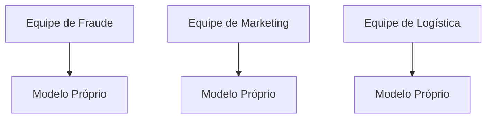
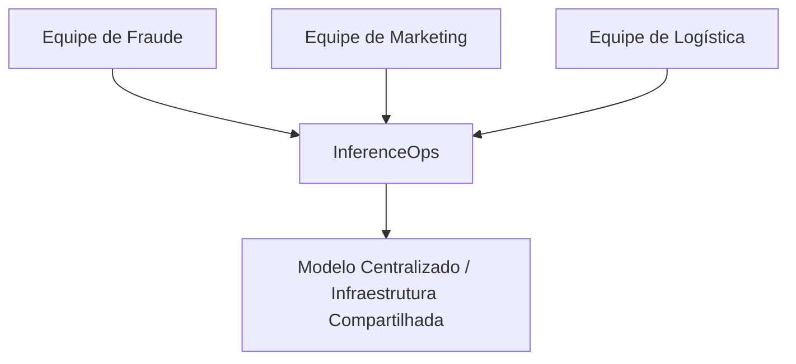
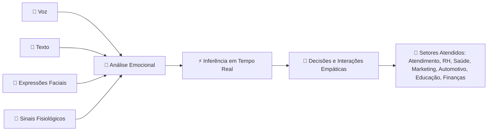
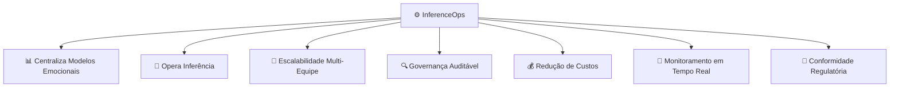

 \[[🇧🇷 Português](README.pt_BR.md)\] \[**[🇺🇸 English](README.md)**\]
 

⠀⠀⠀.　　　　　　　　　　　　　.　　　ﾟ .　　　　　　　　　　　　　. 　　　　　　　　　　　　　　　✦ 　　　　　,　　　　　　　.
⠀⠀⠀⠀⠀⠀⠀⠀⠀⠀⠀⠀⠀⠀⠀⠀⠀
　　　　　　*　　　　　　　　　　　.　✦
　　　　　　*　　　　　　　　. 　　
.　　　　　　　　　　　　　. 　　✦⠀　   　　　,　　　　　　　　　*
　　　　　⠀　　　　⠀　　,
⠀⠀⠀⠀⠀⠀⠀⠀⠀⠀⠀⠀.　　　　　 　　⠀　　　⠀.　
 　　˚　　　⠀　⠀  　　,　  
  [𝛹](https://github.com/user-attachments/assets/4d29c964-8c36-456e-8a04-68fab9ac710c)  𝑬𝒗𝒆𝒓𝒚 𝒐𝒏𝒆 𝒊𝒔 𝒖𝒏𝒊𝒒𝒖𝒆 𝒊𝒏 𝒕𝒉𝒆𝒊𝒓 𝒐𝒘𝒏 𝒘𝒂𝒚   .⭒⋅⊹｡
　　　　　　　　　　　　　.
　　　　　　*⠀　　⠀  　　　　　　　　　　　　

　　　　.　　　　.　　　⠀
　　　　　　　　　　　.   
　　　　　　　
　　　˚　　　　　　　　　　　　　.     

 .⠀　　⠀‍⠀‍⠀‍⠀‍⠀‍⠀‍⠀‍⠀‍⠀‍⠀‍⠀,    
　　　*　　⠀.
　　　　　.　　　　　　　　　　⠀[𖤐](https://github.com/user-attachments/assets/f239865a-de13-4975-a3fd-54d2bb456e01)
　˚　　　　　　　　　　　　　　
.⠀ 　　　　　　　　　　.　　　　　　　　.
　　　　　✦⠀　   　　　,　　    　　　　　　　　.

  

 ### 
 ✯ **[Startupo Project]()** ✯

 

  

<h1 align="center"> 𖤐 $$\Huge {\textbf{\color{white} Mindful} \space \textbf{\color{cyan} Emotional} \space \textbf{\color{white} AI} \space \textbf{\color{cyan} ॐ}}$$ 

   

<!-- MindFul  Emotional AI VIDEO 🇧🇷  -->

https://github.com/user-attachments/assets/e0e61bb2-9925-4653-8ac9-abe61cec8def

<!--===  Torsion VIDEO
https://github.com/user-attachments/assets/9915b330-9845-421d-97ca-6f733d455db0

##### 🎶  ***Creation  by Fabi***  🖤
-->

<!--===  VIVALDI VIDEO
https://github.com/user-attachments/assets/e2771de0-ca57-4750-b708-74f0dceaade3

###### 🎶  ***[Vivaldi - The Four Seasons 'Winter']()  ⚡️ Art by Fabi***  
-->

  

#### 
 

   

#

   

> [!TIP]
>
>  ### Fundadores e Parceiros
>
> * [**Fundadora:**]() Fabiana ⚡️ Campanari  
>
> * [**Parceiros:***]() Pedro Victor, Pedro Barrenco, Andson Ribeiro, Luan Fabiano, Jose Augusto 
>
> * Aberto a [estudantes]() do programa de IA Humanística e Ciência de Dados da [PUC-SP]() 
>
> * [**Apoiadores:**]()Reitor/Diretor/Prof- esta sessão ainda não está pronta...
>
> * Todas as atividades cumprem as [**diretrizes acadêmicas e éticas da PUC-SP**]().

 

#

  

> [!IMPORTANT]
>
>  ### Links das Startups neste Projeto: Brasil e Além 🛸
> 
> - [Planejamento Estratégico Bossa Invest](https://bossainvest.com)
>  
> - [EU AI ACT - Práticas Emocionais Proibidas em IA](https://bluearrow.ai/emotion-recognition/)
>  
> - [Venturus - MindfulaAI](https://venturusai.com/business/1TwGzr-mindfulai/report/finances)
> 
> -  [O que é AI Iference?](https://www.cloudflare.com/learning/ai/inference-vs-training/)
>

  

##  Sumário

1. [Introdução](#introduction)  
2. [A Solução — InferenceOps para Emotion AI](#the-solution-inferenceops-for-emotion-ai)  
3. [Seção Técnica: InferenceOps Passo a Passo com Comandos](#technical-section-inferenceops-step-by-step-with-commands)  
4. [Comparação Direta Entre Modelos - Diagramas](#direct-comparison-between-models)  
5. [Dimensão Ética](#ethical-dimension)  
6. [Top 10 Ferramentas para Desenvolvimento Ético em Emotion AI](#top-10-tools-for-ethical-development-in-emotion-ai)  
7. [Casos Reais de Mercado](#real-market-cases)  
8. [Caso Prático — Detecção de Fraudes com Emotion AI](#practical-case-fraud-detection-with-emotion-ai)  
9. [Melhores Práticas de Implementação](#best-implementation-practices)  
10. [Impacto Social](#social-impact)  
11. [Planejamento Estratégico para a Startup MindfulAI](#strategic-planning-for-the-mindfulai-startup)  
12. [KPIs e Métricas de Sucesso](#kpis-and-success-metrics)  
13. [Plano de Negócios, Unidades de Serviço e Rentabilidade](#business-plan-service-units-and-profitability)  
14. [Estrutura Modular de Serviços na Startup MindfulAI](#modular-service-structure-in-the-mindfulai-startup)  
15. [Roteiro de Implementação](#implementation-roadmap)  
16. [Tipos de Investidores e Programa PUC-Angel](#investor-types-and-puc-angel-program)  
17. [Perguntas Frequentes (FAQ)](#faq-frequently-asked-questions)  
18. [Estrutura do Repositório](#repository-structure)  
19. [Plano Financeiro - MindfulAI](#financial-plan---mindfulai)  
20. [Código e Exemplos](#code-and-examples)  
21. [Equipe](#team)  
22. [Bibliografia](#bibliography)

      

> Nota: Este projeto foi desenvolvido como parte da disciplina de Empreendedorismo e Inovação do programa de graduação em IA Humanística na PUC São Paulo (PUC-SP).
> Alguns dados e cenários apresentados neste documento são fictícios, com a intenção de transformar o conceito inicial em um plano viável e prepará-lo para o lançamento no mundo real.
> MindfulAI visa construir uma solução de Emotion AI ética, escalável e inovadora alinhada às demandas técnicas, regulatórias e sociais atuais.

  

# 1. [Introdução do Projeto - Mindful Emotional AI]()

 

[**Mindful Emotional AI**]() é uma startup inovadora desenvolvida no programa [*IA Humanística e Ciência de Dados* da PUC-SP]. Sua missão é oferecer uma Emotional AI escalável, ética e confiável por meio do paradigma [**InferenceOps**](), garantindo eficiência operacional e governança em tempo real.

 

## [Por que a Mindful Emotional AI é Inovadora?]()

[**Mindful Emotional AI**]() está transformando a forma como entendemos a Emotional AI ao integrar múltiplos tipos de dados: voz, texto, expressões faciais e sinais fisiológicos—para realizar [**inferência em tempo real**](), ou seja, interpretar emoções de maneira imediata e contextual. Isso inclui [**Processamento de Linguagem Natural (NLP)**](), um campo da IA que permite que computadores compreendam, interpretem e gerem a linguagem humana, permitindo que o sistema analise textos e fala como parte do reconhecimento emocional.

Baseada no paradigma [**InferenceOps**]() que envolve implantação, monitoramento e ajuste automatizado de modelos de IA para manter desempenho e eficiência, a startup entrega soluções [**escaláveis**]() capazes de crescer e lidar com volumes cada vez maiores de dados e usuários sem perda de qualidade ou performance, permanecendo transparente e em conformidade com regulamentações internacionais como o [**GDPR**]() (Regulamento Geral de Proteção de Dados da União Europeia) e o [**EU AI Act**]() (marco regulatório europeu para IA ética, segura e transparente).

Sua [**arquitetura modular**]() permite que componentes sejam adaptados ou substituídos de acordo com as necessidades de diferentes setores, como saúde, finanças, publicidade, saúde mental, automotivo e educação. Apoiada por parcerias acadêmicas e ciclos contínuos de inovação, a [**Mindful Emotional AI**]() conecta tecnologia de ponta a impactos sociais e éticos reais.

Ao aplicar técnicas capazes de reconhecer e interpretar emoções humanas a partir de múltiplas fontes de dados, incluindo NLP para texto e fala, a startup possibilita interações mais empáticas e personalizadas, melhora a experiência do usuário e fortalece a tomada de decisões conscientes e responsáveis em contextos que afetam diretamente o cotidiano.

  

> [!IMPORTANT]
>
> Este projeto posiciona a MindfulAI como uma startup de ponta capaz de transformar a relação entre humanos e máquinas por meio de inteligência emocional artificial ética, escalável e governada.
>

  

## [Conceitos Fundamentais: Machine Learning e InferenceOps]()

Machine Learning (ML) é um método pelo qual computadores aprendem padrões a partir dos dados. Após o treinamento, um modelo pode fazer previsões com novos dados — isso é chamado de inferência (Inference).

- [**Treinamento:**]() Fase intensiva onde o modelo é alimentado com dados e ajusta seus parâmetros para aprender padrões. Consome muita capacidade computacional e ocorre periodicamente.
  
- [**Inferência:**]() Fase contínua onde o modelo usa o que aprendeu para fazer previsões em tempo real, exigindo recursos computacionais mais leves, porém constantes.

 

> MindfulAI aplica essa inferência para captar emoções humanas rapidamente e com precisão.

  

## [A Importância da Ética, Governança e Conformidade em Emotion AI]()

Emotion AI lida com dados pessoais e sensíveis, portanto é crucial respeitar:

- [**Ética:**]() Justiça, transparência, respeito à privacidade emocional e diversidade.
- [**Governança:**]() Monitoramento e controle para evitar vieses e uso indevido da IA.
- [**Conformidade:**]() Cumprimento de leis e regulamentos, como GDPR e LGPD (Lei Geral de Proteção de Dados).

 

> Nosso sistema incorpora essas dimensões na operação do InferenceOps, assegurando segurança e responsabilidade.

  

### [O que Oferecemos ?]()

Mindful Emotional AI propõe uma plataforma abrangente de Emotion AI que oferece:

- Análise multidimensional de emoções por múltiplos canais (voz, texto, vídeo, sinais fisiológicos) com dashboards e relatórios.
- APIs para integração com sistemas corporativos e diversas aplicações.
- Serviços de consultoria para implementação ética e estratégica de IA emocional.
- Soluções preditivas que antecipam necessidades emocionais para personalizar respostas e ações.

 

## [Relevância da Mindful Emotional AI para Clientes dos Setores Atendidos]()

A [**Mindful Emotional AI**]() é essencial para os clientes porque oferece uma compreensão profunda e em tempo real das emoções humanas a partir de dados multimodais, como voz, texto e expressões faciais. Essa capacidade gera benefícios concretos em diversos setores:

- [**Atendimento ao Cliente:**]() proporciona interações mais empáticas, aumenta a satisfação, reduz conflitos e fortalece a fidelização.
  
- [**Saúde Mental:**]() permite monitorar estados emocionais, viabilizando intervenções mais eficazes e suporte contínuo.
 
- [**Marketing Digital:**]() personaliza campanhas com base em reações emocionais reais, otimizando engajamento e conversão.
 
- [**Recursos Humanos:**]()  avalia o clima organizacional e o engajamento, promovendo ambientes de trabalho mais produtivos e saudáveis.
  
- [**Indústria Automotiva:**]() identifica sinais de fadiga ou distração do motorista, aumentando a segurança.
 
- [**Educação:**]() acompanha o bem-estar emocional dos estudantes, aprimorando aprendizado e suporte pedagógico.

- [**Finanças e Prevenção a Fraudes:**]() detecta comportamentos suspeitos relacionados a emoções, auxiliando na prevenção de fraudes em transações bancárias, cartões de crédito e seguros, protegendo contra golpes e roubo de identidade, além de garantir maior segurança, mitigação de riscos e conformidade regulatória.

  

> [!IMPORTANT]
>
> * Dessa forma, a **Mindful Emotional AI** eleva a qualidade das decisões e das interações, combinando tecnologia avançada, ética e soluções escaláveis e seguras, gerando impactos positivos como aumento da satisfação do cliente, melhoria do bem-estar emocional, maior produtividade, segurança ampliada e tomada de decisões mais conscientes e responsáveis, beneficiando tanto pessoas quanto negócios.
>
> 

  

## [Modelo Financeiro Simplificado]()

- Receita mensal esperada: R$ 70.000 (assinaturas + serviços personalizados).
- Custos totais estimados: R$ 55.000 (equipe, infraestrutura, marketing).
- Lucro potencial inicial: R$ 15.000 mensais.
- Ponto de equilíbrio com receita de R$ 55.000.

 

## [Equipe e Operação]() - Papéis-chave na equipe:

- Cientistas de Dados em PLN, análise facial e auditiva.
- Engenheiros de ML para implantação e otimização.
- Especialistas em governança e conformidade.
- Desenvolvedores e DevOps para infraestrutura.
- Analistas para monitoramento e KPIs.

 

## [Suporte 24/7]()

- Turnos rotativos com funções técnicas e de monitoramento.
- Equipe de plantão para emergências.
- Processos claros e automação para garantir continuidade.

 

## [Integração com Estudantes da PUC-SP]()

Para fortalecer a operação e inovar constantemente, a MindfulAI integra estudantes da PUC-SP da seguinte forma:

- **Estágios e Trainees:** Experiência prática em projetos reais.
- **Projetos Acadêmicos:** Parcerias com professores para desenvolver soluções conjuntas.
- **Laboratório de Inovação:** Espaço para experimentação e mentoria.
- **Workshops e Treinamentos:** Atualizações constantes em tecnologias e ética.
- **Bolsas e Incentivos:** Reconhecimento e incentivo a talentos dedicados.
- **Comitê Consultivo Estudantil:** Participação ativa em decisões e melhorias.

   

>  Essa parceria promove troca constante entre academia e mercado, fomentando inovação e talentos alinhados.

 

## [Caso Inspirador]()

Seguimos o modelo de grandes players como AWS (plataformas de inferência em IA) e startups bem-sucedidas de Emotion AI, que melhoram a interação e saúde mental digital com governança ética e tecnologia avançada.

  

# 2. [O Problema:]() IA Emocional Tradicional vs IA Emocional Moderna

 

- [Tradicional:]() Isolada por canal, redundante em infraestrutura, com baixa governança e escalabilidade.

- [Moderna:]() Multimodal, integrada, mas exigente em termos de infraestrutura e governança sem uma solução centralizada.

 
  
### - [Exemplos de IA Tradicional]():
  
  - Um banco com um modelo básico de fraude apenas para cartões de crédito.
  - Um e-commerce com um modelo simples de recomendação de produtos.

  

### 
 [Antes]() - ML Tradicional

  

 

#

 

### - [IA Moderna (Hoje)]()

- Modelos [**complexos, pesados e multimodais**]() (texto, imagem, áudio).  
- Eles exigem GPUs, clusters e monitoramento contínuo.

 

### - [Se cada equipe executar seu próprio modelo]():
  
  - Os custos disparam.  
  - Os resultados tornam-se inconsistentes.  
  - Auditorias se tornam impossíveis.

  

### 
  [Depois]() - InferenceOps

  

   

# 3. [A Solução:]() InferenceOps para Emotion AI

 

### [InferenceOps]() centraliza e operacionaliza a inferência dos modelos emocionais, promovendo escalabilidade, governança auditável, redução de custos e conformidade regulatória, oferecendo:

 

[-]() Escalabilidade entre múltiplas equipes.

[-]() Governança clara e auditável.

[-]() Redução de custos com infraestrutura duplicada.

[-]() Métricas e monitoramento em tempo real.

[-]() Conformidade regulatória integrada desde a concepção.

   

## 4. [Comparação Direta Entre Modelos - Diagramas]()

 

### 
 [Multimodal]() - Fluxo de Dados

  

  

#

  

### 
 [InferenceOps]() – Centralização e Governança

  

   

## 5.

  
  
  
  
  
  
  

# 22. [Bibliografia e Links]()

[-]() Christensen, C. (1997). "The Innovator’s Dilemma". Harvard Business Review Press.

[-]() European Union. (2024). EU AI Act — Regulation on Artificial Intelligence.

[-]() Floridi, L. (2019). The Ethics of Artificial Intelligence. Oxford University Press.

[-]() Goodfellow, I., Bengio, Y., & Courville, A. (2016). Deep Learning. MIT Press.

[-]() Jordan, M. & Mitchell, T. (2015). Machine learning: Trends, perspectives, and prospects. Science, 349(6245).

[-]() Porter, M. E. (1996). "What is Strategy?". Harvard Business Review, 74(6), 61-78.

[-]() Porter, M. E. (1985). "Competitive Advantage: Creating and Sustaining Superior Performance". Free Press.

[-]() TitanML. (2025). TitanML Inference Engine: Efficient AI at Scale. Retrieved from https://www.titanml.co

[-]() THIEL, Peter; MASTERS, Blake. Zero to One: notas sobre startups, ou como construir o futuro. 1. ed. Rio de Janeiro: Objetiva, 2014.

[-]()  THIEL, Peter; MASTERS, Blake. Zero to One: notes on startups, or how to build the future. 1st ed. New York: Crown Business, 2014.

[-]() Various articles on Brazilian innovation cases, business strategies, and market disruptions.

 

## [22a.]() Links de Referências Técnicas, Normativas e Acadêmicas

 

1-  https://contaazul.com/blog/planejamento-estrategico-startups/

2-  https://bossainvest.com/planejamento-estrategico/
  
3- https://caputoduarte.com.br/governanca-para-startups-guia-completo-de-documentos-juridicos-essenciais-para-startups/

4- https://baec.com.br/principais-documentos-que-uma-startup-precisa-conhecer-e-elaborar-para-se-desenvolver/
 
5- https://www.randoncorp.com/pt/blog/como-elaborar-um-plano-de-negocio/
  
6- https://www.aradvogadosreunidos.com.br/os-5-principais-documentos-de-toda-startup/

7- (https://agencianovofoco.com.br/papel-ia-emocional-no-atendimento-do-futuro/)  

8- https://www.inhouse.com.br/inteligencia-emocional-como-ela-influencia-no-atendimento-ao-cliente/ 

9- https://cloudcanal.com.br/blog/inteligencia-artificial-ia-no-atendimento-ao-cliente/

10 - https://www.automationanywhere.com/br/company/blog/automation-ai/ai-customer-service-benefits-and-use-cases

11- https://www.csacademy.com.br/blog/inteligencia-artificial-no-atendimento-ao-cliente-beneficios-e-tendencias/ 

14 - https://www.ibm.com/br-pt/think/insights/eliza-effect-avoiding-emotional-attachment-to-ai

15 - https://www.meioemensagem.com.br/sxsw/o-futuro-das-emocoes-na-era-da-inteligencia-artificial

  

## 💌 [Let the data flow... Ping Us]()

 

- 👨🏽‍🚀 **Andson Ribeiro** - [Slide into my inbox]()

- 👩🏻‍🚀 **Fabiana ⚡️ Campanari** - [Shoot me an email](mailto:fabicampanari@proton.me)

- 👨🏽‍🚀  **José Augusto de Souza Oliveira**  - [email]()

- 🧑🏼‍🚀 **Luan Fabiano**  - [email]()

- 👨🏽‍🚀 **Pedro Barrenco**  - [email]()
  
- 🧑🏼‍🚀 **Pedro Vyctor** - [Hit me up by email](mailto:pedro.vyctor00@gmail.com)

  

#### 
  🛸๋ My Contacts [Hub](https://linktr.ee/fabianacampanari)

 

### 
 

  

  ────────────── ⊹🔭๋ ──────────────

<!--

  ────────────── 🛸๋*ੈ✩* 🔭*ੈ₊ ──────────────
-->

 

 ➣➢➤ <a href="#top">Back to Top </a>
  

#

##### 
 Copyright 2025 Mindful-AI-Assistants. Code released under the  [MIT license.](https://github.com/Mindful-AI-Assistants/planet-smart-city-laguna-iot-pucsp/blob/7ac78ed36a9256cbdc0941dbd44fd13b545bc2dd/LICENSE)

