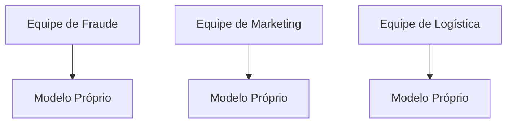
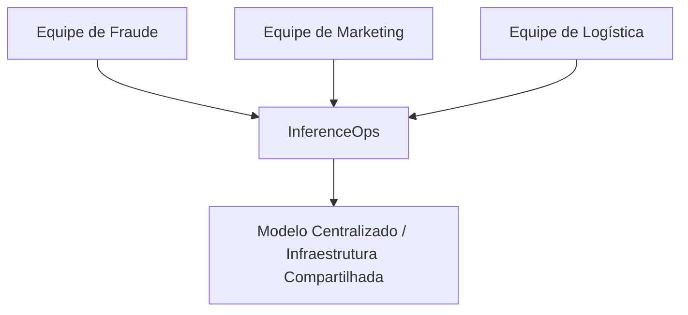
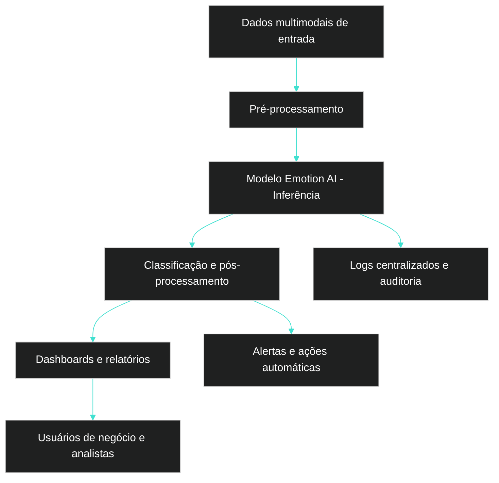
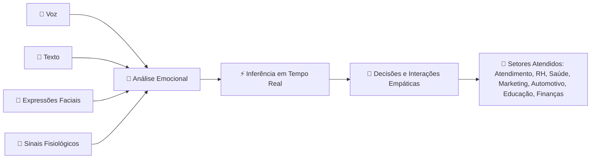
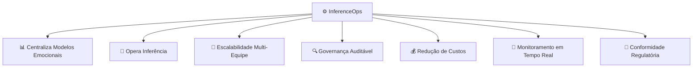

 

 \[[🇧🇷 Português](README.pt_BR.md)\] \[**[🇺🇸 English](README.md)**\]
 

⠀⠀⠀.　　　　　　　　　　　　　.　　　ﾟ .　　　　　　　　　　　　　. 　　　　　　　　　　　　　　　✦ 　　　　　,　　　　　　　.
⠀⠀⠀⠀⠀⠀⠀⠀⠀⠀⠀⠀⠀⠀⠀⠀⠀
　　　　　　*　　　　　　　　　　　.　✦
　　　　　　*　　　　　　　　. 　　
.　　　　　　　　　　　　　. 　　✦⠀　   　　　,　　　　　　　　　*
　　　　　⠀　　　　⠀　　,
⠀⠀⠀⠀⠀⠀⠀⠀⠀⠀⠀⠀.　　　　　 　　⠀　　　⠀.　
 　　˚　　　⠀　⠀  　　,　  
  [𝛹](https://github.com/user-attachments/assets/4d29c964-8c36-456e-8a04-68fab9ac710c)  𝑬𝒗𝒆𝒓𝒚 𝒐𝒏𝒆 𝒊𝒔 𝒖𝒏𝒊𝒒𝒖𝒆 𝒊𝒏 𝒕𝒉𝒆𝒊𝒓 𝒐𝒘𝒏 𝒘𝒂𝒚   .⭒⋅⊹｡
　　　　　　　　　　　　　.
　　　　　　*⠀　　⠀  　　　　　　　　　　　　

　　　　.　　　　.　　　⠀
　　　　　　　　　　　.   
　　　　　　　
　　　˚　　　　　　　　　　　　　.     

 .⠀　　⠀‍⠀‍⠀‍⠀‍⠀‍⠀‍⠀‍⠀‍⠀‍⠀‍⠀,    
　　　*　　⠀.
　　　　　.　　　　　　　　　　⠀[𖤐](https://github.com/user-attachments/assets/f239865a-de13-4975-a3fd-54d2bb456e01)
　˚　　　　　　　　　　　　　　
.⠀ 　　　　　　　　　　.　　　　　　　　.
　　　　　✦⠀　   　　　,　　    　　　　　　　　.

  

 ### 
 ✯ **[Startupo Project]()** ✯

 

  

<h1 align="center">  $$\Huge {\textbf{\color{cyan} Mindful Emotional AI} \space \textbf{\color{white}   InferenceOps • Ethical} \space \textbf{\color{cyan} 𝚿}}$$ 

   

<!-- MindFul  Emotional AI VIDEO 🇧🇷  -->

https://github.com/user-attachments/assets/e0e61bb2-9925-4653-8ac9-abe61cec8def

<!--===  Torsion VIDEO
https://github.com/user-attachments/assets/9915b330-9845-421d-97ca-6f733d455db0

##### 🎶  ***Creation  by Fabi***  🖤
-->

<!--===  VIVALDI VIDEO
https://github.com/user-attachments/assets/e2771de0-ca57-4750-b708-74f0dceaade3

###### 🎶  ***[Vivaldi - The Four Seasons 'Winter']()  ⚡️ Art by Fabi***  
-->

  

 ### 
 [**Presentation**](https://www.beautiful.ai/player/-OaVeXNhzGw-lQajhNjP)

  

#### 
 

  

#

  

> [!TIP]
>
>  ### Fundadores e Parceiros
>
> * [**Fundadora:**]() Fabiana ⚡️ Campanari  
>
> * [**Parceiros:***]() Pedro Victor, Pedro Barrenco, Andson Ribeiro, Luan Fabiano, Jose Augusto 
>
> * Aberto a [estudantes]() do programa de IA Humanística e Ciência de Dados da [PUC-SP]() 
>
> * [**Apoiadores:**]()Reitor/Diretor/Prof- esta sessão ainda não está pronta...
>
> * Todas as atividades cumprem as [**diretrizes acadêmicas e éticas da PUC-SP**]().

 

#

  

> [!IMPORTANT]
>
>  ### Links das Startups neste Projeto: Brasil e Além 🛸
> 
> - [Planejamento Estratégico Bossa Invest](https://bossainvest.com)
>  
> - [EU AI ACT - Práticas Emocionais Proibidas em IA](https://bluearrow.ai/emotion-recognition/)
>  
> - [Venturus - MindfulaAI](https://venturusai.com/business/1TwGzr-mindfulai/report/finances)
> 
> -  [O que é AI Iference?](https://www.cloudflare.com/learning/ai/inference-vs-training/)
>

  

##  Sumário

 

1. [Introdução](#introduction)  
2. [O Problema e a  Solução — InferenceOps para Emotion AI](#the-solution-inferenceops-for-emotion-ai)  
3. [Seção Técnica: InferenceOps Passo a Passo com Comandos](#technical-section-inferenceops-step-by-step-with-commands)  
4. [Comparação Direta Entre Modelos - Diagramas](#direct-comparison-between-models)  
5. [Dimensão Ética](#ethical-dimension)  
6. [Top 10 Ferramentas para Desenvolvimento Ético em Emotion AI](#top-10-tools-for-ethical-development-in-emotion-ai)  
7. [Casos Reais de Mercado](#real-market-cases)  
8. [Caso Prático — Detecção de Fraudes com Emotion AI](#practical-case-fraud-detection-with-emotion-ai)  
9. [Melhores Práticas de Implementação](#best-implementation-practices)  
10. [Impacto Social](#social-impact)  
11. [Planejamento Estratégico para a Startup MindfulAI](#strategic-planning-for-the-mindfulai-startup)  
12. [KPIs e Métricas de Sucesso](#kpis-and-success-metrics)  
13. [Plano de Negócios, Unidades de Serviço e Rentabilidade](#business-plan-service-units-and-profitability)  
14. [Estrutura Modular de Serviços na Startup MindfulAI](#modular-service-structure-in-the-mindfulai-startup)  
15. [Roteiro de Implementação](#implementation-roadmap)  
16. [Tipos de Investidores e Programa PUC-Angel](#investor-types-and-puc-angel-program)  
17. [Perguntas Frequentes (FAQ)](#faq-frequently-asked-questions)  
18. [Estrutura do Repositório](#repository-structure)  
19. [Plano Financeiro - MindfulAI](#financial-plan---mindfulai)  
20. [Código e Exemplos](#code-and-examples)  
21. [Equipe](#team)  
22. [Bibliografia](#bibliography)

      

> [!TIP]
>
> Nota: Este projeto foi desenvolvido como parte da disciplina de Empreendedorismo e Inovação do programa de graduação em IA Humanística na PUC São Paulo (PUC-SP).
> Alguns dados e cenários apresentados neste documento são fictícios, com a intenção de transformar o conceito inicial em um plano viável e prepará-lo para o lançamento no mundo real.
> MindfulAI visa construir uma solução de Emotion AI ética, escalável e inovadora alinhada às demandas técnicas, regulatórias e sociais atuais.
>

  

# 1- [Introdução do Projeto - Mindful Emotional AI]()

 

[**Mindful Emotional AI**]() é uma startup inovadora desenvolvida no programa [*IA Humanística e Ciência de Dados* da PUC-SP]. Sua missão é oferecer uma Emotional AI escalável, ética e confiável por meio do paradigma [**InferenceOps**](), garantindo eficiência operacional e governança em tempo real.

  

## [Por que a Mindful Emotional AI é Inovadora?]()

 

[**Mindful Emotional AI**]() está transformando a forma como entendemos a Emotional AI ao integrar múltiplos tipos de dados: voz, texto, expressões faciais e sinais fisiológicos—para realizar [**inferência em tempo real**](), ou seja, interpretar emoções de maneira imediata e contextual. Isso inclui [**Processamento de Linguagem Natural (NLP)**](), um campo da IA que permite que computadores compreendam, interpretem e gerem a linguagem humana, permitindo que o sistema analise textos e fala como parte do reconhecimento emocional.

 

Baseada no paradigma [**InferenceOps**]() que envolve implantação, monitoramento e ajuste automatizado de modelos de IA para manter desempenho e eficiência, a startup entrega soluções [**escaláveis**]() capazes de crescer e lidar com volumes cada vez maiores de dados e usuários sem perda de qualidade ou performance, permanecendo transparente e em conformidade com regulamentações internacionais como o [**GDPR**]() (Regulamento Geral de Proteção de Dados da União Europeia) e o [**EU AI Act**]() (marco regulatório europeu para IA ética, segura e transparente).

 

Sua [**arquitetura modular**]() permite que componentes sejam adaptados ou substituídos de acordo com as necessidades de diferentes setores, como saúde, finanças, publicidade, saúde mental, automotivo e educação. Apoiada por parcerias acadêmicas e ciclos contínuos de inovação, a [**Mindful Emotional AI**]() conecta tecnologia de ponta a impactos sociais e éticos reais.

 

Ao aplicar técnicas capazes de reconhecer e interpretar [emoções humanas]() a partir [de múltiplas fontes de dados](), incluindo [NLP]()  para texto e fala, a startup possibilita interações mais [empáticas]()  e [personalizadas]() , melhora a experiência do usuário e fortalece a tomada de decisões [conscientes]()  e [responsáveis]()  em contextos que afetam diretamente o cotidiano.

  

> [!IMPORTANT]
>
> ### Este projeto posiciona a MindfulAI como uma startup de ponta capaz de transformar a relação entre humanos e máquinas por meio de inteligência emocional artificial ética, escalável e governada.
>

  

## [Conceitos Fundamentais: Machine Learning e InferenceOps]()

 

Machine Learning (ML) é um método pelo qual computadores aprendem padrões a partir dos dados. Após o treinamento, um modelo pode fazer previsões com novos dados — isso é chamado de inferência (Inference).

- [**Treinamento:**]() Fase intensiva onde o modelo é alimentado com dados e ajusta seus parâmetros para aprender padrões. Consome muita capacidade computacional e ocorre periodicamente.
  
- [**Inferência:**]() Fase contínua onde o modelo usa o que aprendeu para fazer previsões em tempo real, exigindo recursos computacionais mais leves, porém constantes.

  

> [!TIP]
>
> **MindfulAI aplica essa inferência para captar emoções humanas rapidamente e com precisão.**
>

  

## [A Importância da Ética, Governança e Conformidade em Emotion AI]()

 

### - [Emotion AI lida com dados pessoais e sensíveis, portanto é crucial respeitar:]()

 

- [**Ética:**]() Justiça, transparência, respeito à privacidade emocional e diversidade.
 
- [**Governança:**]() Monitoramento e controle para evitar vieses e uso indevido da IA.
 
- [**Conformidade:**]() Cumprimento de leis e regulamentos, como GDPR e LGPD (Lei Geral de Proteção de Dados).

  

> [!IMPORTANT]
>
> Nosso sistema incorpora essas dimensões na operação do InferenceOps, assegurando segurança e responsabilidade.
>

  

## [O que Oferecemos ?]()

 

### - [Mindful Emotional AI propõe uma plataforma abrangente de Emotion AI que oferece:]()

 

[-]() Análise multidimensional de emoções por múltiplos canais (voz, texto, vídeo, sinais fisiológicos) com dashboards e relatórios.
 
[-]() APIs para integração com sistemas corporativos e diversas aplicações.
  
[-]() Serviços de consultoria para implementação ética e estratégica de IA emocional.
  
[-]() Soluções preditivas que antecipam necessidades emocionais para personalizar respostas e ações.

  

## [Relevância da Mindful Emotional AI para Clientes dos Setores Atendidos]()

 

A [**Mindful Emotional AI**]() é essencial para os clientes porque oferece uma compreensão profunda e em tempo real das emoções humanas a partir de dados multimodais, como voz, texto e expressões faciais. Essa capacidade gera benefícios concretos em diversos setores:

 

- [**Atendimento ao Cliente:**]() proporciona interações mais empáticas, aumenta a satisfação, reduz conflitos e fortalece a fidelização.
  
- [**Saúde Mental:**]() permite monitorar estados emocionais, viabilizando intervenções mais eficazes e suporte contínuo.
 
- [**Marketing Digital:**]() personaliza campanhas com base em reações emocionais reais, otimizando engajamento e conversão.
 
- [**Recursos Humanos:**]()  avalia o clima organizacional e o engajamento, promovendo ambientes de trabalho mais produtivos e saudáveis.
  
- [**Indústria Automotiva:**]() identifica sinais de fadiga ou distração do motorista, aumentando a segurança.
 
- [**Educação:**]() acompanha o bem-estar emocional dos estudantes, aprimorando aprendizado e suporte pedagógico.

- [**Finanças e Prevenção a Fraudes:**]() detecta comportamentos suspeitos relacionados a emoções, auxiliando na prevenção de fraudes em transações bancárias, cartões de crédito e seguros, protegendo contra golpes e roubo de identidade, além de garantir maior segurança, mitigação de riscos e conformidade regulatória.

  

> [!IMPORTANT]
>
>  Dessa forma, a **Mindful Emotional AI** eleva a qualidade das decisões e das interações, combinando tecnologia avançada, ética e soluções escaláveis e seguras, gerando impactos positivos como aumento da satisfação do cliente, melhoria do bem-estar emocional, maior produtividade, segurança ampliada e tomada de decisões mais conscientes e responsáveis, beneficiando tanto pessoas quanto negócios.
>
> 

  

<!--

## [Modelo Financeiro Simplificado]()

- Receita mensal esperada: R$ 70.000 (assinaturas + serviços personalizados).
- Custos totais estimados: R$ 55.000 (equipe, infraestrutura, marketing).
- Lucro potencial inicial: R$ 15.000 mensais.
- Ponto de equilíbrio com receita de R$ 55.000.

 

-->

## [Equipe e Operação - Papéis-chave na equipe:]()

 

[-]() Cientistas de Dados em NLP, análise facial e auditiva.

[-]() Engenheiros de ML para implantação e otimização.

[-]() Especialistas em governança e conformidade.

[-]() Desenvolvedores e DevOps para infraestrutura.

[-]() Analistas para monitoramento e KPIs.

  

## [Suporte 24/7]()

 

[-]() Turnos rotativos com funções técnicas e de monitoramento.

[-]() Equipe de plantão para emergências.

[-]() Processos claros e automação para garantir continuidade.

  

## [Integração com Estudantes da PUC-SP]()

 

### - Para fortalecer a operação e [inovar]() constantemente, a Mindful Emotional AI [integra estudantes da PUC-SP]() da seguinte forma:]()

 

- [**Estágios e Trainees:**]() Experiência prática em projetos reais.
  
- [**Projetos Acadêmicos:**]() Parcerias com professores para desenvolver soluções conjuntas.
  
- [**Laboratório de Inovação:**]() Espaço para experimentação e mentoria.
  
- [**Workshops e Treinamentos:**]() Atualizações constantes em tecnologias e ética.
  
- [**Bolsas e Incentivos:**]() Reconhecimento e incentivo a talentos dedicados.
  
- [**Comitê Consultivo Estudantil:**]() Participação ativa em decisões e melhorias.

     

> [!IMPORTANT]
>
>  **Essa parceria promove troca constante entre academia e mercado, fomentando inovação e talentos alinhados.**
>

   

## [Caso Inspirador]()

  

Seguimos o modelo de grandes players como AWS (plataformas de inferência em IA) e startups bem-sucedidas de Emotion AI, que melhoram a interação e saúde mental digital com governança ética e tecnologia avançada.

  

# 2- [O Problema:]() IA Emocional Tradicional vs IA Emocional Moderna

 

- [Tradicional:]() Isolada por canal, redundante em infraestrutura, com baixa governança e escalabilidade.

-  [Moderna:]() Multimodal, integrada, mas exigente em termos de infraestrutura e governança sem uma solução centralizada.

 
  
### - [Exemplos de IA Tradicional]():

 
  
  [-]() Um banco com um modelo básico de fraude apenas para cartões de crédito.
    
  [-]() Um e-commerce com um modelo simples de recomendação de produtos.

  

### 
 [Antes]() - ML Tradicional

  

 

#

 

### - [IA Moderna (Hoje)]()

 

[-]() Modelos [**complexos, pesados e multimodais**]() (texto, imagem, áudio).
  
[-]() Eles exigem GPUs, clusters e monitoramento contínuo.

 

### - [Se cada equipe executar seu próprio modelo:]()

 
  
  [-]() Os custos disparam.
    
  [-]() Os resultados tornam-se inconsistentes.
     
  [-]() Auditorias se tornam impossíveis.

 

#

 

### 
  [Depois]() - InferenceOps

  

   

## 2.1- [A Solução:]() InferenceOps para Emotion AI

 

### - [InferenceOps]() centraliza e operacionaliza a inferência dos modelos emocionais, promovendo escalabilidade, governança auditável, redução de custos e conformidade regulatória, oferecendo:

 

[-]() Escalabilidade entre múltiplas equipes.

[-]() Governança clara e auditável.

[-]() Redução de custos com infraestrutura duplicada.

[-]() Métricas e monitoramento em tempo real.

[-]() Conformidade regulatória integrada desde a concepção.

   

# 3- [Seção Técnica: InferenceOps Passo a Passo com Comandos]()

 

• [Deploy do modelo:]() containerização via Docker e deploy em nuvem.

• [Exposição da API:]() com FastAPI e Uvicorn.

• [Escalabilidade:]() orchestrator Kubernetes com autoscaling ativado.

• [Monitoramento:]() Prometheus e Grafana para métricas e alertas.

• [Gerenciamento de versões:]() deploy Blue-Green ou Canary.

  

### 
 [Diagramao]() Otimizado

  

   

# 4- [Comparação Direta entre Modelos]()

  

| [Aspecto]()            | [Traditional ML Ops]()        | [InferenceOps]()                        |
|--------------------|--------------------------|-----------------------------------|
| [Infraestrutura]()     | Duplicada                | Centralizada e compartilhada      |
| [Custos]()            | Altos por redundância    | Eficientes via compartilhamento   |
| [Governança]()        | Fragmentada              | Centralizada e auditável          |
| [Confiabilidade]()    | Variável                 | Robusta e consistente             |
| [Escalabilidade]()    | Limitada                 | Multiuso e expansível             |
| [Ética/Compliance]()  | Complexa                 | Embutida por design               |

  

## 4.1- [Comparação Direta Entre Modelos - Diagramas]()

 

### 
 [Multimodal]() - Fluxo de Dados

  

  

#

  

### 
 [InferenceOps]() – Centralização e Governança

  

  

#

  

## 4.2- [Exemplos Práticos de Custo Computacional - Treinamento vs Inferência de IA]()

  

| [Aspecto]()                 | [Treinamento de IA]()                           | [Inferência de IA]()                         |
|--------------------------|-------------------------------------------|-----------------------------------------|
| [**Descrição**]()             | Processo de ensinar o modelo com muitos dados, ajustando seus parâmetros | Processo em que o modelo já treinado usa o aprendizado para analisar dados novos e fazer previsões |
| [**Uso de recursos**]()       | Muito alto: requer muitas horas/dias em GPUs poderosas para processar dados e ajustar pesos | Menor, mas contínuo: cada previsão usa menos recursos, porém ocorre muitas vezes ao dia/mês |
| [**Exemplo prático**]()        | Treinar um modelo de reconhecimento de voz com milhares de horas de áudio, rodando por vários dias em servidores de alto desempenho | Usar o modelo treinado para converter a voz do usuário em texto em tempo real no celular |
| [**Comparação de custo**]()    | Treinamento pode custar milhares de dólares em computação em nuvem para um grande modelo | Inferência pode custar centavos por mil previsões, mas o custo acumula com muitos usuários |
| [**Frequência**]()             | Uma vez ou poucas vezes (quando o modelo precisa ser atualizado) | Contínua, toda vez que o sistema usa a IA para uma previsão ou decisão |
| [**Duração típica**]()         | Dias a semanas dependendo do modelo e dados | Milissegundos a segundos por previsão |
| [**Impacto da escala**]()      | Maior escala significa mais dados e mais tempo de processamento para treinar | Maior escala significa mais previsões feitas, aumentando os custos de inferência proporcionalmente |

 

### [Conclusão]()

- O [**treinamento**]() é uma etapa pesada e mais cara, mas é feita esporadicamente.
  
- A [**inferência**]() é uma etapa leve, porém constante, que ocorre toda vez que o sistema utiliza a IA para decisões em tempo real.
  
- É comum que a soma de custos da inferência ao longo do tempo seja significativa, especialmente para serviços com muitos usuários.

  

# 5- [Dimensão Ética]()

  

Garantias de transparência, responsabilidade, privacidade fim a fim, conformidade com GDPR, LGPD e AI Act, e sustentabilidade. A dimensão ética é um pilar fundamental para a MindfulAI, refletindo o compromisso firme com a transparência, responsabilidade e alinhamento regulatório internacional.

Destacamos especialmente a conformidade rigorosa com o AI Act da União Europeia (EU AI Act), um marco regulatório essencial para tecnologias de inteligência artificial que utilizam sistemas de reconhecimento emocional baseados em dados biométricos.

 

## 5.1- [Regulamentação e Definição conforme EU AI Act]()

 

O EU AI Act representa um avanço significativo na regulação da IA, especialmente no que tange aos sistemas de reconhecimento de emoções. Conforme o Artigo 3(39) do AI Act, um "sistema de reconhecimento de emoções" é uma tecnologia que identifica ou infere emoções ou intenções de pessoas naturais com base em dados biométricos — físicos, fisiológicos ou comportamentais, como imagens faciais ou padrões de voz.

O Recital 18 esclarece que esses sistemas abrangem emoções como felicidade, tristeza, raiva, e mais, mas excluem estados físicos simples, como fadiga, exceto em casos de segurança (ex.: prevenção de acidentes de motoristas).

 

## 5.2- [Proibições e Classificação de Alto Risco]()

 

[-]() Proibição no ambiente de trabalho e educacional: Conforme o Artigo 5(1)(f), o uso desses sistemas nesses locais é proibido, salvo para finalidades médicas ou de segurança, dada a alta possibilidade de resultados enviesados, discriminatórios e a complexidade dos sinais emocionais em diferentes culturas e indivíduos.
  
[-]() Classificação como sistema de alto risco: O Anexo III classifica esses sistemas como “alto risco”, sujeitando-os a rigorosos requisitos regulatórios devido ao potencial de discriminação e impacto sobre direitos fundamentais.

 

## 5.3- [Transparência e Proteção de Dados]()

 

[-]() O Artigo 50(3) do AI Act exige que os usuários saibam quando seus dados biométricos são processados para inferência emocional, assegurando transparência acessível inclusive para grupos vulneráveis, conforme Recital 132.
 
[-]() O Regulamento Geral sobre a Proteção de Dados (GDPR) complementa esse quadro, impondo regras estritas para o tratamento dos dados biométricos, que são dados sensíveis. Compliance com GDPR é obrigatória, garantindo a proteção dos direitos e liberdades dos indivíduos.

 

## 5.4- [Equilíbrio entre Inovação e Regulação]()

 

O AI Act busca equilibrar a inovação tecnológica com proteção aos direitos fundamentais, impondo medidas para mitigar riscos de uso indevido e discriminação. A classificação de alto risco não significa permissão automática, pois o uso deve estar conforme leis existentes e princípios da Carta dos Direitos Fundamentais da UE.

  

## 5.5- [Datas Importantes]()

 

[-]() 12 de julho de 2024: Publicação oficial do AI Act.

[-]() 1º de agosto de 2024: Entrada em vigor do AI Act.

[- ]()2 de fevereiro de 2025: Proibição de uso dos sistemas de reconhecimento emocional no trabalho e escolas.

[-]() 2 de agosto de 2026: Regras específicas de sistemas de alto risco entram em vigor.

 

## 5.6- [Fiscalização e Penalidades]()

 

[-]() Não conformidade pode resultar em multas administrativas de até 35 milhões de euros ou 7% do faturamento mundial da empresa, o que for maior.

[-]() Penalidades específicas para prestadores, distribuidores, importadores, entre outros, podem chegar a 15 milhões de euros ou 3% do faturamento anual.

[-]() Informações falsas ou incompletas podem gerar multas de até 7,5 milhões de euros ou 1% do faturamento.

[-]() Micro, pequenas e médias empresas têm multas proporcionais e limitadas.

 

## 5.7- [Passos para Conformidade]()

 

[1](). Entender escopo e definições: Confirmar se o sistema se enquadra como sistema de reconhecimento de emoções (Art. 3(39)).

[2](). Avaliar proibições e classificações: Garantir que o uso não esteja em locais proibidos; verificar se o sistema é de alto risco.

[3](). Medidas de Transparência: Informar os usuários sobre o uso de dados biométricos para inferência.

[4](). Proteção de Dados: Alinhar processamento com GDPR, implementando salvaguardas eficientes.

[5](). Gestão de Riscos: Avaliar e mitigar vieses e riscos de discriminação.

[6](). Documentação: Manter registros detalhados de conformidade.

[7](). Engajamento com Autoridades: Consultar órgãos reguladores para garantir alinhamento.

[8](). Monitoramento contínuo: Revisar e atualizar práticas regularmente, incluindo treinamentos.

[9](). Considerações Legais e Éticas: Assegurar alinhamento com a Carta dos Direitos Fundamentais da UE e normas éticas rigorosas.

  

# 6- [Top 10 Ferramentas para Desenvolvimento Ético de IA]()

 

À medida que os sistemas de IA se tornam mais difundidos, é essencial abordar riscos e vieses potenciais. Esta seção apresenta as principais ferramentas para desenvolvimento de IA ética, garantindo que os sistemas sejam justos, transparentes, privados e seguros.

  

> [!IMPORTANTE]
>
> * Essas ferramentas apoiam o desenvolvimento de sistemas de IA confiáveis, promovendo a inovação com respeito à justiça, privacidade, transparência e segurança.
>

   

| [Propósito e Link]()                                                                                                              | [Descrição]()                                                                                     |
|-------------------------------------------------------------------------------------------------------------------------------|-------------------------------------------------------------------------------------------------|
| [TensorFlow's Responsible AI Toolkit](https://www.tensorflow.org/responsible_ai)                                                 | Identifica e reduz vieses, protege a privacidade e promove transparência                       |
| [Microsoft Responsible AI Toolbox](https://responsibleaitoolbox.ai/)                                                            | Avalia justiça do modelo, fornece insights para decisões informadas                            |
| [IBM AI Explainability 360](https://aix360.res.ibm.com/)                                                                         | Explica como modelos fazem previsões e identifica vieses                                     |
| [Amazon SageMaker Clarify](https://aws.amazon.com/sagemaker/clarify/)                                                           | Detecta vieses e explica decisões para resultados justos                                     |
| [Google's What-If Tool](https://pair-code.github.io/what-if-tool/)                                                              | Aumenta transparência e justiça ao analisar o comportamento do modelo                         |
| [Fairness Indicators by TensorFlow](https://www.tensorflow.org/tfx/guide/fairness_indicators)                                    | Avalia desempenho e identifica disparidades entre grupos                                     |
| [AI Fairness 360 by IBM](https://ai-fairness-360.org/)                                                                           | Mede e mitiga vieses em modelos de IA                                                       |
| [Ethics & Algorithms Toolkit by PwC](https://www.pwc.com)                                                                        | Gerencia riscos de IA, assegura padrões éticos                                              |
| [Deon by DrivenData](https://deon.drivendata.org/)                                                                               | Adiciona checklist de ética em projetos de ciência de dados                                 |
| [Ethical OS Toolkit](https://oecd-opsi.org/toolkits/ethical-os-toolkit/)                                                         | Identifica riscos e danos éticos                                                            |

  

# 7- [Casos Reais de Mercado e Exemplos Brasileiros]()

  

- [**Saúde Mental:**]() A startup brasileira **Vittude** utiliza tecnologias semelhantes à Mindful Emotional AI para oferecer terapia online com suporte emocional, alcançando aumento de 40% na adesão e satisfação dos pacientes.
  
- [**Atendimento:**]() A empresa **Take Blip** integrou sistemas de análise emocional para melhorar o atendimento via chatbots, reduzindo o tempo de resolução de chamadas em até 30%.
  
- [**Marketing Digital:**]() A **Resultados Digitais (RD Station)** aplica análise de perfil emocional em campanhas, aumentando a taxa de conversão em 15% em clientes que utilizam IA emocional.
  
- [**Recursos Humanos:**]() A startup **Sólides** usa dados emocionais para melhorar o clima organizacional e reduzir rotatividade, constatando redução de 20% no turnover em clientes corporativos.
  
- [**Segurança Veicular:**]() A **Autotrac** combina sensores emocionais com dados analíticos para reduzir acidentes, comprovando diminuição de 25% nos incidentes entre frotas monitoradas.

  

## 7.1- [Métricas para Medir ResultadosCasos Reais de Mercado]()

 

### - [Saúde Mental (ex: Vittude):]()
  
  - Taxa de adesão de pacientes (% crescimento mensal)
  - Índice de satisfação do paciente (NPS)
  - Taxa de engajamento em sessões e programas

 

### - [Atendimento (ex: Take Blip)]():
  
  - Tempo médio para resolução de atendimento (minutos)
  - Taxa de resolução no primeiro contato (%)
  - NPS para satisfação do cliente
 
    

### - [Marketing Digital (ex: RD Station)]():
  
  - Taxa de conversão das campanhas (%)
  - Custo por lead (CPL)
  - Retorno sobre investimento (ROI) em campanhas emocionais

 

### - [Recursos Humanos (ex: Sólides)]():
  
  - Taxa de rotatividade de funcionários (%)
  - Índice de clima organizacional (pesquisas internas)
  - Redução do absenteísmo e afastamentos relacionados ao estresse

 

### - [Segurança Veicular (ex: Autotrac)]():
  
  - Redução percentual de acidentes em frotas (%)
  - Tempo médio até detecção de fadiga ou distração (minutos)
  - Número de incidentes relacionados a erro humano
 

  

# 8-. [Caso Prático — Detecção de Fraude com Mindful Emotional AI]()

  

A empresa brasileira **Neoway** implementou a tecnologia de Emotion AI para detecção de fraudes financeiras, integrando sinais emocionais da comunicação do cliente com dados transacionais. O resultado foi uma redução de 35% em falsos positivos e maior eficiência na identificação de fraudes complexas, resultando em economias significativas para bancos parceiros.

 

## 8.1 Métricas para Medir  [Detecção de Fraude com Mindful Emotional AI]()

  

- Taxa de falsos positivos (%)
- Precisão na detecção de fraude (%)
- Redução no tempo de investigação de casos suspeitos (horas/dias)
- Economia gerada em custos operacionais devido à redução de fraudes

  

# 9- [ Boas Práticas de Implementação]()

  

### - [A Mindful Emotional AI recomenda:]()

- Rigoroso pré-processamento de dados para alta qualidade.
- Uso de APIs escaláveis para fácil integração com sistemas legados.
- Monitoramento em tempo real para ajustes imediatos na performance.
- Atualizações frequentes para manter precisão e relevância.
- Governança sólida alinhada às regulações locais e internacionais.

 

## 9.1-  Métricas para Medir  [Boas Práticas de Implementação]()

  

- Taxa de downtime do sistema (% do tempo operacional)
- Latência média da API (milissegundos)
- Número de atualizações/treinamentos realizados por período
- Taxa de conformidade com normas internas e regulatórias (%)

  

# 10- [Impacto Social]()

  

Com a Mindful Emotional AI, empresas brasileiras têm promovido saúde emocional e bem-estar. Programas de prevenção ao estresse e burnout são fortalecidos pela análise contínua de dados emocionais, criando ambientes corporativos mais humanos e empáticos. O impacto social inclui maior produtividade, engajamento e qualidade de vida entre trabalhadores e usuários de serviços.

 

## 10.1- Métricas para Medir [Impacto Social]()

  

- Índice de redução de estresse e burnout (%) em colaboradores
- Aumento na percepção de humanização tecnológica (pesquisa qualitativa)
- Aumento da produtividade medido por metas alcançadas (%)
- Feedback positivo de usuários e colaboradores (NPS ou similar)

  

> [!TIP]
>
> Essas métricas fornecem indicadores quantitativos e qualitativos essenciais para avaliar o sucesso, atuação e impacto da Mindful Emotional AI em diversos setores, garantindo melhorias contínuas e alinhamento com expectativas de clientes e regulamentações.
>

   

# 11.- [Planejamento Estratégico para Startup de MindFul Emotional AI ]()

  

## 11.1-  [Missão e Visãol]()

 

### - [**Missão**]()  

Desenvolver e oferecer soluções éticas, escaláveis e governadas de IA Emocional que aprimorem as interações humanas por meio de inteligência artificial emocional responsável.

 

### - [**Visão**]()   

Ser referência global em tecnologia de IA Emocional, reconhecida por inovação, ética e impacto positivo na vida das pessoas e nas organizações até 2030.

  

## 11.2- [Análise de Mercado e Público-Alvo]()

  

[-]() O mercado global e nacional de IA Emocional está se expandindo rapidamente, particularmente por meio de modelos SaaS.
  
[-]() Clientes-alvo incluem empresas dos setores de saúde, finanças, recursos humanos, atendimento ao cliente, segurança veicular e, principalmente, cadeia de suprimentos e logística.
  
[-]() Há uma demanda crescente por tecnologias éticas e em conformidade regulatória, especialmente com regulamentações como AI Act e GDPR.
  
[-]() A análise de concorrência identifica players diretos e indiretos para encontrar oportunidades de diferenciação.

  

## 11.3- [Análise SWOT]()

 

| [Forças]()                       | [Fraquezas]()                     |
|--------------------------------|-------------------------------|
| Tecnologia única InferenceOps   | Startup em estágio inicial    |
| Forte conformidade ética        | Investimento inicial significativo |
| Parceria acadêmica com PUC-SP   | Dependência da aceitação do mercado |

 

| [Oportunidades]()                   | [Ameaças]()                   |
|---------------------------------|--------------------------------|
| Mercado de IA Emocional em crescimento | Forte concorrência internacional |
| Adoção regulatória favorável    | Riscos de segurança e reputação |
| Expansão internacional          | Mudanças regulatórias rápidas   |

  

## 11.4- [Objetivos e Metas]()

 

### - [**Objetivos Estratégicos**]()

- Desenvolver e lançar um MVP funcional em até 6 meses.  
- Alcançar 1.000 clientes em até 12 meses.  
- Estabelecer parcerias estratégicas acadêmicas e comerciais.  
- Garantir plena conformidade com regulamentações globais.

 

### - [**Metas Específicas**]()  

- Concluir P&D com alunos da PUC-SP até o mês 4.  
- Implementar a infraestrutura InferenceOps até o mês 5.  
- Obter assinaturas piloto iniciais até o mês 8.  
- Validar o processo de governança e auditoria até o mês 10.

  

## 11.5- [Contexto de Negócio: Importância da Cadeia de Suprimentos]()

 

A cadeia de suprimentos é um sistema crítico e complexo que integra todas as atividades envolvidas na produção e entrega de bens ou serviços, desde a aquisição de matéria-prima até a entrega final ao cliente. A gestão eficiente da cadeia envolve compras, produção, armazenamento, transporte e logística, exigindo coordenação precisa para minimizar custos, otimizar prazos e manter a qualidade. Na Mindful Emotional AI, a integração da análise emocional permite identificar precocemente erros humanos, estresse e fadiga entre operadores e gestores, alinhando a inteligência artificial à melhoria contínua da produtividade e segurança operacional. Essa abordagem inovadora busca não apenas eficiência logística, mas também ambientes de trabalho mais saudáveis e sustentáveis, garantindo conformidade ética e regulatória ao longo de todo o ciclo da cadeia de suprimentos.

  

## 11.6- [Plano de Ação]()

 

| [Tarefa]()                  | [Responsável]()    | [Prazo]()   | [Observações]()                 |
|----------------------------|-----------------|------------|---------------------------------|
| Pesquisa e desenvolvimento | Equipe Técnica  | Meses 1-4  | Integração com PUC-SP           |
| Desenvolvimento do MVP     | Dev & ML        | Meses 3-6  | API, infraestrutura, governança |
| Lançamento piloto          | Comercial       | Meses 6-9  | Feedback e ajustes              |
| Marketing e vendas         | Marketing       | Meses 6-12 | Campanhas focadas e marketing digital |
| Parcerias e conformidade   | Jurídico/Compliance | Contínuo | Alinhamento regulatório         |

  

## 11.7- [Orçamento e Recursos]()

 

- Infraestrutura tecnológica: servidores, nuvem, ferramentas de monitoramento.  
- Equipe interdisciplinar: cientistas de dados, engenheiros, especialistas em ética e compliance.  
- Marketing digital e eventos para aquisição de clientes.  
- Consultoria jurídica e treinamentos.

  

## 11.8- [Monitoramento e Avaliação]()

 

- KPIs alinhados aos objetivos: adoção de clientes, receita, satisfação, conformidade.  
- Revisões estratégicas trimestrais para ajustes com base em dados de desempenho.  
- Flexibilidade para adaptação rápida às mudanças do mercado.

  

  
  
  

  

  

# 19. [Plano Financeiro – Mindful Emotion AI]()

Este plano consolida e corrige inconsistências, fornecendo projeções transparentes, detalhamentos operacionais, ponto de equilíbrio e fluxo de caixa para uma gestão sustentável.

 

## 19.1 [Projeções Financeiras]()

O crescimento é baseado num modelo de assinatura SaaS com serviços de IA customizados.

- [**Previsão de usuários ativos:**]() Começa com 1.000 e escala até 10.000 em 12 meses.
- [**ARPU inicial:**]() R$ 80,00/mês.
- [**Receita adicional:**]() Projetos de consultoria/integração.

  

| [Mês]() | [Usuários Ativos]() | [Receita Mensal (R$)]() | [Custos Fixos (R$)]() | [Custos Variáveis (R$)]() | [Lucro Estimado (R$)]() |
|-------|--------------|---------------------|------------------|---------------------|-----------------------|
| 1     | 1.000        | 80.000              | 40.000           | 20.000              | 20.000                |
| 6     | 5.000        | 400.000             | 60.000           | 80.000              | 260.000               |
| 12    | 10.000       | 800.000             | 90.000           | 160.000             | 550.000               |

  

_Todas as receitas, custos e lucros são consistentes com o crescimento de usuários e ARPU, escalando custos de nuvem e equipe de forma proporcional._

  

## 19.2 [Estrutura de Custos Operacionais]()

- **Infraestrutura de nuvem:** ~30%
- **Equipe técnica:** ~40%
- **Marketing/aquisição:** ~20%
- **Administrativo/jurídico:** ~10%

 

## 19.3 [Análise do Ponto de Equilíbrio]()

- **Ponto de equilíbrio:** Alcançado com ~1.200 usuários (R$ 96.000/mês de receita)
- **Prazo esperado:** 4 a 6 meses após o lançamento, conforme projeção de crescimento.

 

## 19.4 [Fluxo de Caixa e Financiamento]()

- **Monitoramento mensal** para garantir solvência e reinvestimento.
- **Capital inicial** via investidores-anjo/PUC-Angel.
- **Rodadas de VC** planejadas para escalar após o MVP.

 

### [Resumo do Primeiro Ano]()

  

| [Item]()              | [Valor Mensal (R$)]() | [Observações]()                                       |
|-----------------------|-----------------------|-------------------------------------------------------|
| [**Receita**]()       |                       |                                                       |
| Assinaturas SaaS      | 50.000                | Assinaturas recorrentes                               |
| Serviços customizados | 20.000                | Consultoria, integração                               |
| [**Receita Total**]() | 70.000                |                                                       |
| [**Custos Fixos**]()  |                       |                                                       |
| Salários/benefícios   | 30.000                | Técnica, vendas, administrativa                       |
| Infraestrutura/nuvem  | 10.000                | Computação, armazenamento                             |
| Marketing/vendas      | 5.000                 | Aquisição                                             |
| Admin (escritório)    | 5.000                 | Legal, contábil                                       |
| [**Total Fixos**]()   | 50.000                |                                                       |
| [**Custos Variáveis**]() | 5.000                 | Suporte/otimização                                    |
| [**Lucro Líquido**]() | 15.000                | Após todos os custos                                  |

  

[**Ponto de equilíbrio:**]() R$ 55.000/mês  
[**Receita mensal projetada:**]() R$ 70.000  
[**Margem de segurança inicial:**]() R$ 15.000

  

## 19.5 [Insights de Gestão]()

- Acompanhe a consistência mensalmente: atualize projeções, ações e metas.
- Ajuste o escalonamento de custos/receitas conforme base real de usuários.
- KPIs: ARPU, churn, CAC, fluxo de caixa, margem de lucro—revisão mensal.
- Use ferramentas financeiras automáticas e conciliação bancária regular para precisão [web:519].
- Refaça previsões de caixa trimestralmente considerando índices confiáveis, caso haja inflação [web:521][web:522].

 

**Referências:**

- [Financial Modeling for AI Startups – Finrofca](https://www.finrofca.com/news/financial-modeling-for-ai-startups)  
- [Planejamento de receita SaaS – GetSmartCue](https://www.getsmartcue.com/blog/saas-financial-model-template)  
- [Modelos SaaS – Chargebee](https://www.chargebee.com/blog/saas-financial-models/)

  

  

## 21.  [Nossa TRipilação]()

- 👨🏽‍🚀 [**Andson Ribeiro**](https://github.com/andsonandreribeiro09)

- 👩🏻‍🚀 **Fabiana ⚡️ Campanari** - [Shoot me an email](mailto:fabicampanari@proton.me)

- 👨🏽‍🚀  [**José Augusto de Souza Oliveira**](https://github.com/Jojose3)

- 🧑🏼‍🚀 [**Luan Fabiano**](https://github.com/LuanFabiano28)

- 👨🏽‍🚀 [**Pedro Barrenco**](https://github.com/Pgbarenco)
  
- 🧑🏼‍🚀 [**Pedro Vyctor**](https://github.com/Pgbarenco)

  

# 22. [Bibliografia e Links]()

[-]() Christensen, C. (1997). "The Innovator’s Dilemma". Harvard Business Review Press.

[-]() European Union. (2024). EU AI Act — Regulation on Artificial Intelligence.

[-]() Floridi, L. (2019). The Ethics of Artificial Intelligence. Oxford University Press.

[-]() Goodfellow, I., Bengio, Y., & Courville, A. (2016). Deep Learning. MIT Press.

[-]() Jordan, M. & Mitchell, T. (2015). Machine learning: Trends, perspectives, and prospects. Science, 349(6245).

[-]() Porter, M. E. (1996). "What is Strategy?". Harvard Business Review, 74(6), 61-78.

[-]() Porter, M. E. (1985). "Competitive Advantage: Creating and Sustaining Superior Performance". Free Press.

[-]() TitanML. (2025). TitanML Inference Engine: Efficient AI at Scale. Retrieved from https://www.titanml.co

[-]() THIEL, Peter; MASTERS, Blake. Zero to One: notas sobre startups, ou como construir o futuro. 1. ed. Rio de Janeiro: Objetiva, 2014.

[-]()  THIEL, Peter; MASTERS, Blake. Zero to One: notes on startups, or how to build the future. 1st ed. New York: Crown Business, 2014.

[-]() Various articles on Brazilian innovation cases, business strategies, and market disruptions.

 

## [22a.]() Links de Referências Técnicas, Normativas e Acadêmicas

 

1-  https://contaazul.com/blog/planejamento-estrategico-startups/

2-  https://bossainvest.com/planejamento-estrategico/
  
3- https://caputoduarte.com.br/governanca-para-startups-guia-completo-de-documentos-juridicos-essenciais-para-startups/

4- https://baec.com.br/principais-documentos-que-uma-startup-precisa-conhecer-e-elaborar-para-se-desenvolver/
 
5- https://www.randoncorp.com/pt/blog/como-elaborar-um-plano-de-negocio/
  
6- https://www.aradvogadosreunidos.com.br/os-5-principais-documentos-de-toda-startup/

7- (https://agencianovofoco.com.br/papel-ia-emocional-no-atendimento-do-futuro/)  

8- https://www.inhouse.com.br/inteligencia-emocional-como-ela-influencia-no-atendimento-ao-cliente/ 

9- https://cloudcanal.com.br/blog/inteligencia-artificial-ia-no-atendimento-ao-cliente/

10 - https://www.automationanywhere.com/br/company/blog/automation-ai/ai-customer-service-benefits-and-use-cases

11- https://www.csacademy.com.br/blog/inteligencia-artificial-no-atendimento-ao-cliente-beneficios-e-tendencias/ 

14 - https://www.ibm.com/br-pt/think/insights/eliza-effect-avoiding-emotional-attachment-to-ai

15 - https://www.meioemensagem.com.br/sxsw/o-futuro-das-emocoes-na-era-da-inteligencia-artificial

 

## [22a.]() Links of Financial Reference

 

1 - https://upmetrics.co/template/saas-business-plan-example/financial-plan

2 -  https://lucid.now/blog/ai-forecasting-for-balanced-startup-investments/

3 -  https://www.zeni.ai/blog/break-even-analysis

4 - https://payproglobal.com/pt_br/calculadoras-de-metricas-de-saas/calculadora-de-receita-media-por-usuario-arpu-de-saas/

5- https://stripe.com/br/resources/more/revenue-planning-101-a-guide-for-businesses

6 - https://www.sba.gov/business-guide/plan-your-business/calculate-your-startup-costs/break-even-point

  

## 💌 [Let the data flow... Ping Me!]()

  

#### 
  🛸๋ My Contacts [Hub](https://linktr.ee/fabianacampanari)

 

### 
 

  

  ────────────── ⊹🔭๋ ──────────────

<!--

  ────────────── 🛸๋*ੈ✩* 🔭*ੈ₊ ──────────────
-->

 

 ➣➢➤ <a href="#top">Back to Top </a>
  

#

##### 
 Copyright 2025 Mindful-AI-Assistants. Code released under the  [MIT license.](https://github.com/Mindful-AI-Assistants/planet-smart-city-laguna-iot-pucsp/blob/7ac78ed36a9256cbdc0941dbd44fd13b545bc2dd/LICENSE)

