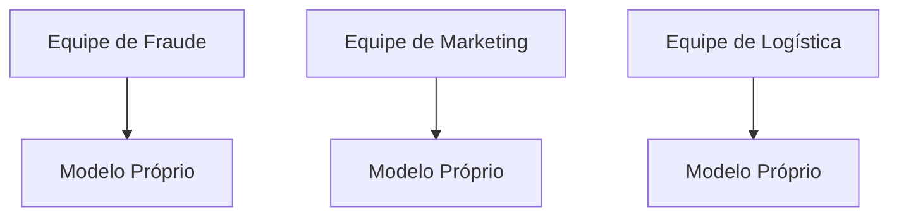
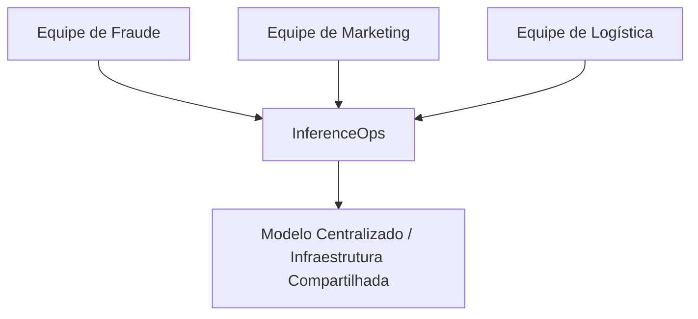
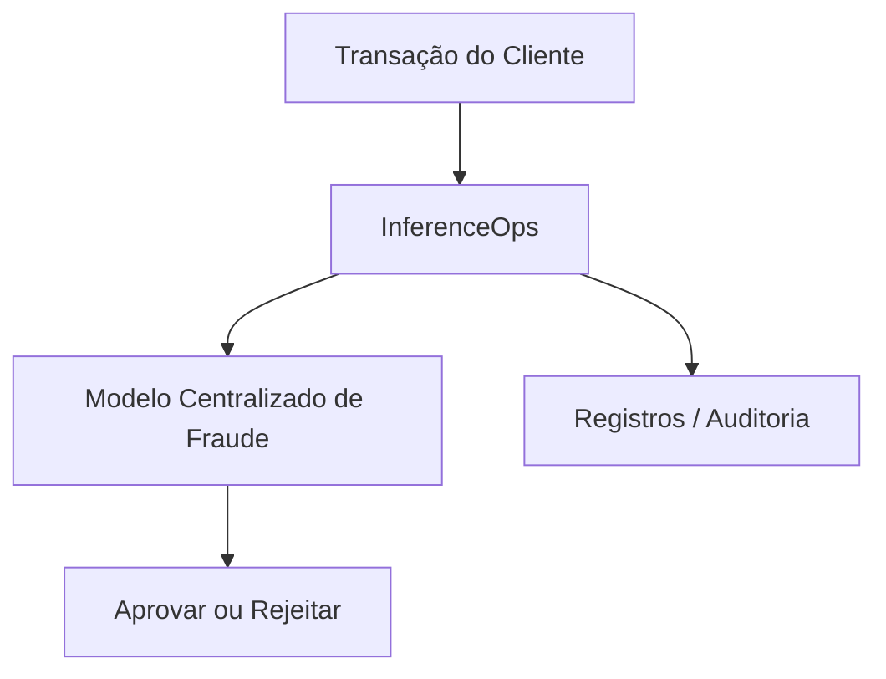
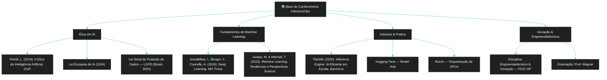

  
 
 \[**[🇧🇷 Português](README.pt_BR.md)**\] \[[🇺🇸 English](README.md)\]

     

 #  
  InferenceOps: Inovação Embutida para Escalabilidade, Ética e Lucratividade em IA

     

  #### 
 

     

https://github.com/user-attachments/assets/e2771de0-ca57-4750-b708-74f0dceaade3

###### 🎶  ***[Vivaldi - The Four Seasons 'Winter']()  ⚡️ Art by Fabi***  

<!--Confidentiality Statement-->

  

## Índice

 

> [!TIP]  
>   1. Introdução(#1-introduction)  
>   2. O Problema: ML Tradicional vs IA Moderna(#2-the-problem-traditional-ml-vs-modern-ai)  
>   3. A Solução — InferenceOps(#3-the-solution--inferenceops)  
>   4. Diagramas Explicativos(#4-explanatory-diagrams)  
>   5. Comparação Direta(#5-direct-comparison)  
>   6. Dimensão Ética(#6-ethical-dimension)  
>   6a. Top 10 Ferramentas para Desenvolvimento de IA Ética()  
>   7. Casos Reais de Uso de Mercado(#7-real-market-use-cases)  
>   8. Caso Prático — Detecção de Fraude(#8-practical-case--fraud-detection)  
>   9. Melhores Práticas de Implementação(#9-implementation-best-practices)  
>   10. Impacto Social(#10-social-impact)  
>   11. KPIs e Métricas de Sucesso(#11-kpis-and-success-metrics)  
>   12. Plano de Negócios e Rentabilidade(#12-business-plan-and-profitability)  
>   13. Roteiro de Implementação(#13-implementation-roadmap)  
>   14. FAQ (Perguntas Frequentes)(#14-faq-frequently-asked-questions)  
>   15. Estrutura do Repositório(#15-repository-structure)  
>   16. 📊 Plano Financeiro (InferenceOps-Innovation)(#16-financial-plan-inferenceops-innovation)  
>   17. Receita vs Custos - Código()  
>   18. Exemplos de Código Adicionais()  
>    - Código de Análise Financeira()  
>    - Simulação de Detecção de Fraude()  
>   19. 🧑🏼‍🚀 Membros da Equipe()  
>   20. Bibliografia()

  

## 1. [Introdução]()

Este projeto foi desenvolvido para a disciplina **Empreendedorismo e Inovação** como parte do [**programa de graduação em IA Humanística e Ciência de Dados da PIUC - São Paulo**](), sob a orientação do [**Professor Wagner Tufano**]().

O objetivo deste trabalho é demonstrar como as organizações podem ir [**além das práticas tradicionais de MLOps**]() e adotar [**InferenceOps**]() como um novo paradigma operacional para Inteligência Artificial.  

Enquanto o MLOps foi projetado para gerenciar pipelines de Machine Learning e ciclos de vida de modelos, [**InferenceOps**]() aborda os desafios únicos de implantar e escalar sistemas de IA que vão além de modelos estatísticos — sistemas capazes de raciocinar, se adaptar e interagir em tempo real.  

InferenceOps não é apenas uma mudança técnica; representa uma [**abordagem inovadora, ética e financeiramente viável**]() para adoção de IA, garantindo escalabilidade, governança e confiança.  

Este repositório combina [**fundamentos técnicos**](), [**aplicações no mundo real**]() e um [**plano financeiro**]() para ilustrar como InferenceOps pode ser implementado de forma sustentável e lucrativa.

  

## 2. [O Problema: ML Tradicional vs IA Moderna]()

 

### [ML Tradicional (passado)]()

- Cada equipe tinha seu próprio modelo (fraude, marketing, logística).  
- Funcionava porque os modelos eram simples e isolados.

 
  
[Exemplos]():
  
  - Um banco com um modelo básico de fraude apenas para cartões de crédito.  
  - Um e-commerce com um modelo simples de recomendação de produtos.

 

#

 

### [IA Moderna (presente)]()

 

- Os modelos são **complexos, pesados, multimodais** (texto, imagem, áudio).  
- Eles exigem GPUs, clusters e monitoramento contínuo.

[Se cada equipe executa seu próprio modelo]():
  
  - Os custos disparam.  
  - Os resultados são inconsistentes.  
  - A auditoria se torna impossível.

  

## 3. [A Solução — InferenceOps]()

[**InferenceOps**]() é uma plataforma de inferência centralizada. Ela fornece:

[-]() Escalabilidade entre múltiplas equipes.

[-]() Governança clara e auditável.

[-]() Redução dos custos de duplicação de infraestrutura.

[-]() Métricas e monitoramento em tempo real.

[-]() Conformidade regulatória desde o design.

  

## 4. [Diagramas Explicativos]()

 

### [Antes (ML Tradicional)]()

  

 

#

 

### [Depois (InferenceOps)]()

  

## 5. [Comparação Direta]()

  

| [Aspecto]()          | [ML Tradicional]()        | [InferenceOps]()                     |
|--------------------|--------------------------|----------------------------------|
| [Infraestrutura]()     | Cada equipe executa seus próprios servidores   | Plataforma centralizada e compartilhada      |
| [Custos]()              | Altos (duplicação)       | Otimizados (infra compartilhada)         |
| [Governança]()         | Fragmentada               | Centralizada e auditável          |
| [Confiabilidade]()        | Inconsistente             | Padronizada e robusta            |
| [Escalabilidade]()        | Limitada                  | Multiuso e expansível         |
| [Ética & Conformidade]() | Difícil de garantir           | Integrada desde o design               |

  

## 6. [Dimensão Ética]()

 

[InferenceOps incorpora ética na arquitetura]():

 

[-]() Transparência: decisões auditáveis.
 
[-]() Responsabilidade: registros centralizados.
 
[-]() Privacidade: criptografia de ponta a ponta.

[-]() Conformidade: GDPR, LGPD, AI Act.
 
[-]() Sustentabilidade: consumo de energia reduzido.

  

## 6a. [Top 10 Ferramentas para Desenvolvimento de IA Ética]()

 

À medida que os sistemas de IA se tornam mais difundidos, é essencial lidar com riscos e vieses potenciais. Esta seção apresenta as principais ferramentas para desenvolver IA ética, garantindo que os sistemas sejam justos, transparentes, privados e seguros.  

  

> [!IMPORTANT]  
>
> * Essas ferramentas apoiam o desenvolvimento de sistemas de IA confiáveis, promovendo a inovação com respeito à justiça, privacidade, transparência e segurança.  
>

  

| Finalidade e Link                                                                                                              | [Descrição]()                                                                                     |
|-------------------------------------------------------------------------------------------------------------------------------|-------------------------------------------------------------------------------------------------|
| [Responsible AI Toolkit do TensorFlow](https://www.tensorflow.org/responsible_ai)                                                 | Identifica e reduz vieses, protege a privacidade e promove transparência                        |
| [Responsible AI Toolbox da Microsoft](https://responsibleaitoolbox.ai/)                                                           | Avalia a justiça do modelo e fornece insights para decisões informadas                         |
| [IBM AI Explainability 360](https://aix360.res.ibm.com/)                                                                         | Explica como os modelos fazem previsões e identifica vieses                                    |
| [Amazon SageMaker Clarify](https://aws.amazon.com/sagemaker/clarify/)                                                           | Detecta vieses e explica decisões para resultados mais justos                                  |
| [What-If Tool do Google](https://pair-code.github.io/what-if-tool/)                                                              | Aumenta a transparência e a justiça, analisando o comportamento do modelo                      |
| [Fairness Indicators do TensorFlow](https://www.tensorflow.org/tfx/guide/fairness_indicators)                                    | Avalia o desempenho e identifica disparidades entre grupos                                     |
| [AI Fairness 360 da IBM](https://ai-fairness-360.org/)                                                                           | Mede e mitiga vieses em modelos de IA                                                          |
| [Ethics & Algorithms Toolkit da PwC](https://www.pwc.com)                                                                        | Gerencia riscos de IA e assegura padrões éticos                                                |
| [Deon da DrivenData](https://deon.drivendata.org/)                                                                               | Adiciona listas de verificação ética a projetos de ciência de dados                            |
| [Ethical OS Toolkit](https://oecd-opsi.org/toolkits/ethical-os-toolkit/)                                                         | Identifica riscos e danos éticos                                                               |

    

## 7. [Casos Reais de Mercado]()

 

- [**Bancos & Fintechs**]() — decisões consistentes de crédito e fraude.
  
- [**Saúde**]() — diagnósticos confiáveis e auditáveis.
  
- [**E-commerce**]() — recomendações e logística unificadas.

- [**Setor Público**]() — políticas transparentes impulsionadas por IA.

  

## 8. [Caso Prático — Detecção de Fraudes]()

Antes: cada equipe tinha seu próprio modelo de fraude.  
Depois: um modelo centralizado detecta fraudes em tempo real e gera registros de auditoria automáticos.

  

#### [-]() Um script de demonstração simples é fornecido [aqui]()

#### [-]() Um script de demonstração detalhado é fornecido [aqui]()

  

  
  
  
  
  
  

## 🧑🏼‍🚀 [Team Members]():

| Name                    | Role                                             |
|-------------------------|--------------------------------------------------|
| **Andson Ribeiro**       | [Github](https://github.com/andsonandreribeiro09) - [Contact]() |
| **Fabiana ⚡️ Campanari** | [Github](https://github.com/FabianaCampanari) - [Contact Hub](https://linktr.ee/fabianacampanari)   |
| **Pedro Barrenco** |   [Github]()  - [Contact]()  |
|  **Pedro Vyctor Almeida** |  [Github](https://github.com/ppvyctor) - [Contact]()    |

  

 ##  20. ## [Referências / Bibliografias]()

  

  

[-]() Jordan, M. & Mitchell, T. (2015). **Aprendizado de Máquina: Tendências, Perspectivas e Prospectos.** *Science, 349(6245).*  

[-]() Floridi, L. (2019). **A Ética da Inteligência Artificial.** Oxford University Press.  

[-]() Goodfellow, I., Bengio, Y., & Courville, A. (2016). **Aprendizado Profundo (Deep Learning).** MIT Press.  

[-]() TitanML. (2025). **TitanML Inference Engine: IA Eficiente em Escala.** Recuperado de https://www.titanml.co  

[-]() União Europeia. (2024). **AI Act da União Europeia — Regulamento sobre Inteligência Artificial.**  

  

## 💌 [Let the data flow... Ping Us]()

- 👨🏽‍🚀 **Andson Ribeiro** - [Slide into my inbox]()

- 👩🏻‍🚀 **Fabiana ⚡️ Campanari** - [Shoot me an email](mailto:fabicampanari@proton.me)

- 👨🏽‍🚀 **Pedro Barrenco** - 
  
- 🧑🏼‍🚀 **PedroVyctor** - [Hit me up by email](mailto:pedro.vyctor00@gmail.com)

  

#### 
  🛸๋ My Contacts [Hub](https://linktr.ee/fabianacampanari)

 

### 
 

  

  ────────────── ⊹🔭๋ ──────────────

<!--

  ────────────── 🛸๋*ੈ✩* 🔭*ੈ₊ ──────────────
-->

 

 ➣➢➤ <a href="#top">Back to Top </a>
  

#

##### 
 Copyright 2025 Mindful-AI-Assistants. Code released under the  [MIT license.](https://github.com/Mindful-AI-Assistants/planet-smart-city-laguna-iot-pucsp/blob/7ac78ed36a9256cbdc0941dbd44fd13b545bc2dd/LICENSE)

