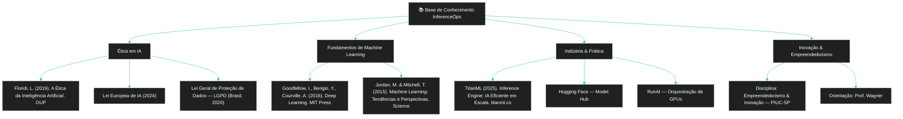

  
 
 \[**[🇧🇷 Português](README.pt_BR.md)**\] \[[🇺🇸 English](README.md)\]

     

 #  
  InferenceOps: Inovação Embutida para Escalabilidade, Ética e Lucratividade em IA

     

  #### 
 

     

## 1. [Introdução]()

Este projeto foi desenvolvido para a disciplina **Empreendedorismo e Inovação** como parte do [**programa de graduação em IA Humanística e Ciência de Dados da PIUC - São Paulo**](), sob a orientação do [**Professor Wagner Tufano**]().

O objetivo deste trabalho é demonstrar como as organizações podem ir [**além das práticas tradicionais de MLOps**]() e adotar [**InferenceOps**]() como um novo paradigma operacional para Inteligência Artificial.  

Enquanto o MLOps foi projetado para gerenciar pipelines de Machine Learning e ciclos de vida de modelos, [**InferenceOps**]() aborda os desafios únicos de implantar e escalar sistemas de IA que vão além de modelos estatísticos — sistemas capazes de raciocinar, se adaptar e interagir em tempo real.  

InferenceOps não é apenas uma mudança técnica; representa uma [**abordagem inovadora, ética e financeiramente viável**]() para adoção de IA, garantindo escalabilidade, governança e confiança.  

Este repositório combina [**fundamentos técnicos**](), [**aplicações no mundo real**]() e um [**plano financeiro**]() para ilustrar como InferenceOps pode ser implementado de forma sustentável e lucrativa.

  

## 2. [O Problema: ML Tradicional vs IA Moderna]()

 

### [ML Tradicional (passado)]()

- Cada equipe tinha seu próprio modelo (fraude, marketing, logística).  
- Funcionava porque os modelos eram simples e isolados.

 
  
[Exemplos]():
  
  - Um banco com um modelo básico de fraude apenas para cartões de crédito.  
  - Um e-commerce com um modelo simples de recomendação de produtos.

 

#

 

### [IA Moderna (presente)]()

 

- Os modelos são **complexos, pesados, multimodais** (texto, imagem, áudio).  
- Eles exigem GPUs, clusters e monitoramento contínuo.

[Se cada equipe executa seu próprio modelo]():
  
  - Os custos disparam.  
  - Os resultados são inconsistentes.  
  - A auditoria se torna impossível.

  

## 3. [A Solução — InferenceOps]()

[**InferenceOps**]() é uma plataforma de inferência centralizada. E

  
  
  
  
  
  

## 🧑🏼‍🚀 [Team Members]():

| Name                    | Role                                             |
|-------------------------|--------------------------------------------------|
| **Andson Ribeiro**       | [Github](https://github.com/andsonandreribeiro09) - [Contact]() |
| **Fabiana ⚡️ Campanari** | [Github](https://github.com/FabianaCampanari) - [Contact Hub](https://linktr.ee/fabianacampanari)   |
| **Pedro Barrenco** |   [Github]()  - [Contact]()  |
|  **Pedro Vyctor Almeida** |  [Github](https://github.com/ppvyctor) - [Contact]()    |

  

 ##  20. ## [Referências / Bibliografias]()

  

  

[-]() Jordan, M. & Mitchell, T. (2015). **Aprendizado de Máquina: Tendências, Perspectivas e Prospectos.** *Science, 349(6245).*  

[-]() Floridi, L. (2019). **A Ética da Inteligência Artificial.** Oxford University Press.  

[-]() Goodfellow, I., Bengio, Y., & Courville, A. (2016). **Aprendizado Profundo (Deep Learning).** MIT Press.  

[-]() TitanML. (2025). **TitanML Inference Engine: IA Eficiente em Escala.** Recuperado de https://www.titanml.co  

[-]() União Europeia. (2024). **AI Act da União Europeia — Regulamento sobre Inteligência Artificial.**  

  

## 💌 [Let the data flow... Ping Us]()

- 👨🏽‍🚀 **Andson Ribeiro** - [Slide into my inbox]()

- 👩🏻‍🚀 **Fabiana ⚡️ Campanari** - [Shoot me an email](mailto:fabicampanari@proton.me)

- 👨🏽‍🚀 **Pedro Barrenco** - 
  
- 🧑🏼‍🚀 **PedroVyctor** - [Hit me up by email](mailto:pedro.vyctor00@gmail.com)

  

#### 
  🛸๋ My Contacts [Hub](https://linktr.ee/fabianacampanari)

 

### 
 

  

  ────────────── ⊹🔭๋ ──────────────

<!--

  ────────────── 🛸๋*ੈ✩* 🔭*ੈ₊ ──────────────
-->

 

 ➣➢➤ <a href="#top">Back to Top </a>
  

#

##### 
 Copyright 2025 Mindful-AI-Assistants. Code released under the  [MIT license.](https://github.com/Mindful-AI-Assistants/planet-smart-city-laguna-iot-pucsp/blob/7ac78ed36a9256cbdc0941dbd44fd13b545bc2dd/LICENSE)

