```mermaid
%%{init: {'theme':'dark', 'themeVariables': {
    'primaryColor': '#1abc9c',
    'edgeLabelBackground':'#1abc9c',
    'lineColor': '#1abc9c',
    'secondaryColor':'#16a085',
    'tertiaryColor':'#0e6655',
    'fontSize':'16px',
    'fontFamily':'Arial',
    'textColor':'#ffffff'
}}}%%
flowchart TD
    A[📚 Base de Conhecimento InferenceOps] --> B[Ética em IA]
    A --> C[Fundamentos de Machine Learning]
    A --> D[Indústria & Prática]
    A --> E[Inovação & Empreendedorismo]

    B --> B1["Floridi, L. (2019). A Ética da Inteligência Artificial. OUP"]
    B --> B2["Lei Europeia de IA (2024)"]
    B --> B3["Lei Geral de Proteção de Dados — LGPD (Brasil, 2020)"]

    C --> C1["Goodfellow, I., Bengio, Y., Courville, A. (2016). Deep Learning. MIT Press"]
    C --> C2["Jordan, M. & Mitchell, T. (2015). Machine Learning: Tendências e Perspectivas. Science"]

    D --> D1["TitanML (2025). Inference Engine: IA Eficiente em Escala. titanml.co"]
    D --> D2["Hugging Face — Model Hub"]
    D --> D3["RunAI — Orquestração de GPUs"]

    E --> E1["Disciplina: Empreendedorismo & Inovação — PIUC-SP"]
    E --> E2["Orientação: Prof. Wagner"]
```
  
 
 \[**[🇧🇷 Português](README.pt_BR.md)**\] \[[🇺🇸 English](README.md)\]

     

 #  
  InferenceOps: Inovação Embutida para Escalabilidade, Ética e Lucratividade em IA

     

  #### 
 

     

  
  
  
  
  
  

## 🧑🏼‍🚀 [Team Members]():

| Name                    | Role                                             |
|-------------------------|--------------------------------------------------|
| **Andson Ribeiro**       | [Github](https://github.com/andsonandreribeiro09) - [Contact]() |
| **Fabiana ⚡️ Campanari** | [Github](https://github.com/FabianaCampanari) - [Contact Hub](https://linktr.ee/fabianacampanari)   |
| **Pedro Barrenco** |   [Github]()  - [Contact]()  |
|  **Pedro Vyctor Almeida** |  [Github](https://github.com/ppvyctor) - [Contact]()    |

  

  

## 💌 [Let the data flow... Ping Us]()

- 👨🏽‍🚀 **Andson Ribeiro** - [Slide into my inbox]()

- 👩🏻‍🚀 **Fabiana ⚡️ Campanari** - [Shoot me an email](mailto:fabicampanari@proton.me)

- 👨🏽‍🚀 **Pedro Barrenco** - 
  
- 🧑🏼‍🚀 **PedroVyctor** - [Hit me up by email](mailto:pedro.vyctor00@gmail.com)

  

#### 
  🛸๋ My Contacts [Hub](https://linktr.ee/fabianacampanari)

 

### 
 

  

  ────────────── ⊹🔭๋ ──────────────

<!--

  ────────────── 🛸๋*ੈ✩* 🔭*ੈ₊ ──────────────
-->

 

 ➣➢➤ <a href="#top">Back to Top </a>
  

#

##### 
 Copyright 2025 Mindful-AI-Assistants. Code released under the  [MIT license.](https://github.com/Mindful-AI-Assistants/planet-smart-city-laguna-iot-pucsp/blob/7ac78ed36a9256cbdc0941dbd44fd13b545bc2dd/LICENSE)

