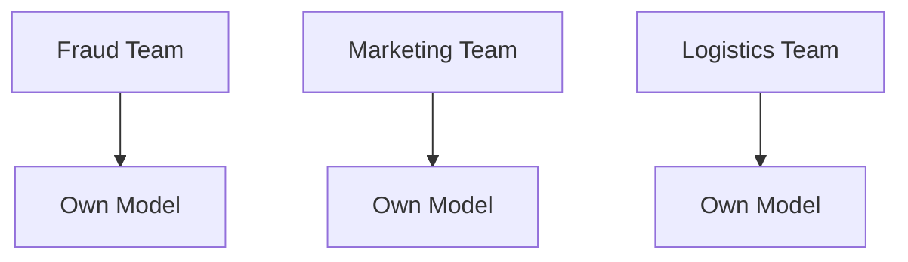
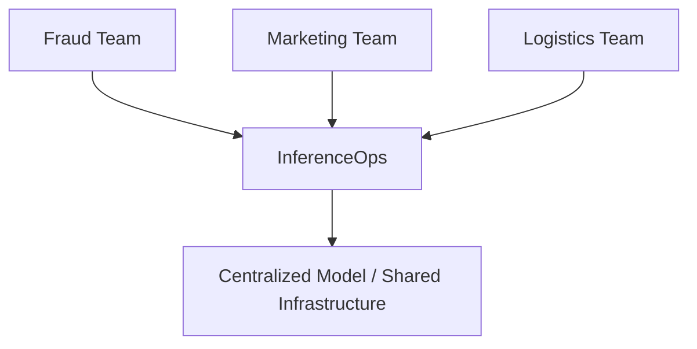
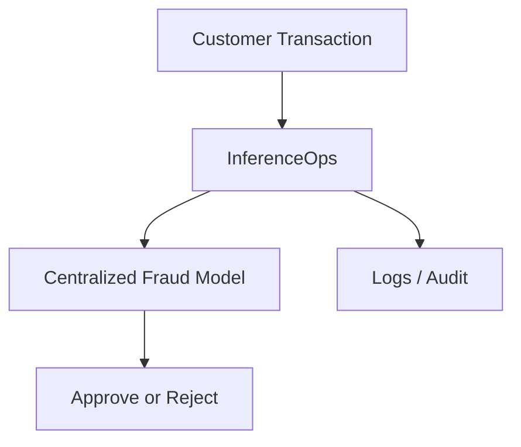

> [!TIP]
>   1. [Introduction](#1-introduction)  
>   2. [The Problem: Traditional ML vs Modern AI](#2-the-problem-traditional-ml-vs-modern-ai)  
>   3. [The Solution — InferenceOps](#3-the-solution--inferenceops)
>   4. [Explanatory Diagrams](#4-explanatory-diagrams) 
>   5. [Direct Comparison](#5-direct-comparison)   
>   6. [Ethical Dimension](#6-ethical-dimension)
>   7. [Top 10 Tools for Ethical AI Development]()  
>   8. [Real Market Use Cases](#7-real-market-use-cases) 
>   9. [Practical Case — Fraud Detection](#8-practical-case--fraud-detection)
>  10. [Implementation Best Practices](#9-implementation-best-practices)  
>   11. [Social Impact](#10-social-impact) 
>   12. [KPIs and Success Metrics](#11-kpis-and-success-metrics)  
>   13. [Business Plan and Profitability](#12-business-plan-and-profitability)  
>   14. [Implementation Roadmap](#13-implementation-roadmap)  
>   15. [FAQ (Frequently Asked Questions)](#14-faq-frequently-asked-questions) 
>   16. [Repository Structure](#15-repository-structure) 
>   17. [📊 Financial Plan (InferenceOps-Innovation)](#16-financial-plan-inferenceops-innovation)  
>   18. [Revenue vs Costs - Code]()
>   19. [Additional Code Examples]()
>    - [Financial Analysis Code]() 
>    - [Fraud Detection Simulation]()
>   20. 🧑🏼‍🚀 [Team Members]():
>   21. [Bibliography]()
>
> 

    
     
  

## 1. [Introduction]()

This project was developed for the course **Entrepreneurship and Innovation** as part of the [**Humanistic AI and Data Science undergraduate program at PIUC - São Paulo**](), under the guidance of [**Professor Wagner  Tufano**]().

The objective of this work is to demonstrate how organizations can move [**beyond traditional MLOps practices**]() and adopt [**InferenceOps**]() as a new operational paradigm for Artificial Intelligence.  

While MLOps was designed to manage Machine Learning pipelines and model lifecycles, [**InferenceOps**]() addresses the unique challenges of deploying and scaling AI systems that go beyond statistical models — systems capable of reasoning, adapting, and interacting in real time.  

InferenceOps is not just a technical shift; it represents an [**innovative, ethical, and financially viable approach**]() to AI adoption, ensuring scalability, governance, and trust.  

This repository combines [**technical foundations**](), [**real-world applications**](), and a [**financial plan**]() to illustrate how InferenceOps can be implemented sustainably and profitably.

  

## 2. [The Problem: Traditional ML vs Modern AI]()

 

### [Traditional ML (past)]()

- Each team had its own model (fraud, marketing, logistics).
- It worked because models were simple and isolated.

 
 
  
[Examples]():
  
  - A bank with a basic fraud model only for credit cards.
  - An e-commerce with a simple product recommendation model.

 

#

 

### [Modern AI (present)]()

 

- Models are **complex, heavy, multimodal** (text, image, audio).
- They require GPUs, clusters, and continuous monitoring.

[If each team runs its own model]():
  
  - Costs skyrocket.
  - Results are inconsistent.
  - Auditing becomes impossible.

  

## 3. [The Solution — InferenceOps]()

[**InferenceOps**]() is a centralized inference platform. It provides:

[-]() Scalability across multiple teams.

[-]() Clear and auditable governance.

[-]() Reduced infrastructure duplication costs.

[-]() Real-time metrics and monitoring.

[-]() Regulatory compliance by design.

  

## 4. [Explanatory Diagrams]()

 

### [Before (Traditional ML)]()

  

 

#

 

### [After (InferenceOps)]()

  

  

## 5. [Direct Comparison]()

  

| [Aspect]()          | [Traditional ML Ops]()        | [InferenceOps]()                     |
|--------------------|--------------------------|----------------------------------|
| [Infrastructure]()     | Each team runs servers   | Centralized shared platform      |
| [Costs]()              | High (duplication)       | Optimized (shared infra)         |
| [Governance]()         | Fragmented               | Centralized & auditable          |
| [Reliability]()        | Inconsistent             | Standardized & robust            |
| [Scalability]()        | Limited                  | Multi-use and expandable         |
| [Ethics & Compliance]() | Hard to ensure           | Built-in by design               |

  

## 6. [Ethical Dimension]()

 

[InferenceOps embeds ethics into the architecture]():

 

[-]() Transparency: auditable decisions.
 
[-]() Accountability: centralized logs.
 
[-]() Privacy: end-to-end encryption.

[-]() Compliance: GDPR, LGPD, AI Act.
 
[-]() Sustainability: reduced energy consumption.

  

## 7. [Top 10 Tools for Ethical AI Development]()

 

As AI systems become more widespread, it is essential to address potential risks and biases. This section presents the top tools for developing ethical AI, ensuring that systems are fair, transparent, private, and secure.

  
  

> [!IMPORTANT]
>
> * These tools support the development of trustworthy AI systems, promoting innovation with respect for fairness, privacy, transparency, and security.
>

  

| Purpose and Link                                                                                                              | [Description]()                                                                                     |
|-------------------------------------------------------------------------------------------------------------------------------|-------------------------------------------------------------------------------------------------|
| [TensorFlow's Responsible AI Toolkit](https://www.tensorflow.org/responsible_ai)                                                 | Identifies and reduces biases, protects privacy, and promotes transparency                       |
| [Microsoft Responsible AI Toolbox](https://responsibleaitoolbox.ai/)                                                            | Assesses model fairness, provides insights for informed decisions                              |
| [IBM AI Explainability 360](https://aix360.res.ibm.com/)                                                                         | Explains how models make predictions and identifies biases                                     |
| [Amazon SageMaker Clarify](https://aws.amazon.com/sagemaker/clarify/)                                                           | Detects biases and explains decisions for fair outcomes                                        |
| [Google's What-If Tool](https://pair-code.github.io/what-if-tool/)                                                              | Enhances transparency and fairness by analyzing model behavior                                 |
| [Fairness Indicators by TensorFlow](https://www.tensorflow.org/tfx/guide/fairness_indicators)                                    | Evaluates performance and identifies disparities between groups                                |
| [AI Fairness 360 by IBM](https://ai-fairness-360.org/)                                                                           | Measures and mitigates biases in AI models                                                    |
| [Ethics & Algorithms Toolkit by PwC](https://www.pwc.com)                                                                        | Manages AI risks, ensures ethical standards                                                   |
| [Deon by DrivenData](https://deon.drivendata.org/)                                                                               | Adds ethics checklist to data science projects                                                 |
| [Ethical OS Toolkit](https://oecd-opsi.org/toolkits/ethical-os-toolkit/)                                                         | Identifies ethical risks and harms                                                            |

  

## 8. [Real Market Use Cases]()

 

- [**Banks & Fintechs**]() — consistent credit and fraud decisions.
  
- [**Healthcare**]() — reliable and auditable diagnostics.
  
- [**E-commerce**]() — unified recommendations and logistics.

- [**Public Sector**]() — transparent policies powered by AI.

  

## 9. [Practical Case — Fraud Detection]()

  

#### [-]() A simple demonstration script is provided [here]().

#### [-]() A detailed demonstration script is provided [here]().

  

  

  
  
  
  
  
  

## 20. 🧑🏼‍🚀 [Team Members]():

| Name                    | Role                                             |
|-------------------------|--------------------------------------------------|
| **Andson Ribeiro**       | [Github](https://github.com/andsonandreribeiro09) - [Contact]() |
| **Fabiana ⚡️ Campanari** | [Github](https://github.com/FabianaCampanari) - [Contact Hub](https://linktr.ee/fabianacampanari)   |
| **José Augusto de Souza Oliveira**       |   [Github](https://github.com/Jojose3)  - [Contact]()   |
| **Luan Fabiano**         | [Github](https://github.com/LuanFabiano28) -  [Contact]() |
| **Pedro Barrenco**       |   [Github]()  - [Contact]()   |
|  **Pedro Vyctor Almeida** |  [Github](https://github.com/ppvyctor) - [Contact]()    |

  

 ##  21.[References / Bibliography]()

```mermaid
%%{init: {'theme':'dark', 'themeVariables': {
    'primaryColor': '#1abc9c',
    'edgeLabelBackground':'#1abc9c',
    'lineColor': '#1abc9c',
    'secondaryColor':'#16a085',
    'tertiaryColor':'#0e6655',
    'fontSize':'16px',
    'fontFamily':'Arial',
    'textColor':'#ffffff'
}}}%%
flowchart TD
    A[📚 InferenceOps Knowledge Base] --> B[AI Ethics]
    A --> C[Machine Learning Foundations]
    A --> D[Industry & Practice]
    A --> E[Innovation & Entrepreneurship]

    B --> B1["Floridi, L. (2019). The Ethics of Artificial Intelligence. OUP"]
    B --> B2["EU AI Act (2024)"]
    B --> B3["Brazil LGPD (2020)"]

    C --> C1["Goodfellow, I., Bengio, Y., Courville, A. (2016). Deep Learning. MIT Press"]
    C --> C2["Jordan, M. & Mitchell, T. (2015). Machine Learning: Trends, Perspectives, and Prospects. Science"]

    D --> D1["TitanML (2025). Inference Engine: Efficient AI at Scale. titanml.co"]
    D --> D2["Hugging Face — Model Hub"]
    D --> D3["RunAI — GPU Orchestration"]

    E --> E1["Course: Entrepreneurship & Innovation — PIUC-SP"]
    E --> E2["Guidance: Prof. Wagner"]
```
   
      

